[English](../../en/articles/skill-execution-engineering.md) | [文章与博客](README.md)

# Skill 已经有了，为什么 AI 还是不听话？

> 从案例、Skill 到稳定执行：写给 Skill 作者的工程实践与 Loom 入门

**核心观点：Skill 保存领域方法；Loom 为使用该 Skill 的工作提供可检查、可运行、可恢复的 Workflow 脊梁。**这条脊梁让方法不必依赖某一次对话或某一个模型调用，并为兼容的 Agent 提供明确接入面。它不会替作者创造方法，不保证模型输出相同，也不代表任意宿主无需适配。

## 目录

- [Part 1：我已经有 Skill，为什么 AI 还是不听话](#part-1我已经有-skill为什么-ai-还是不听话)
- [Part 2：我认为自己没有 Workflow](#part-2我认为自己没有-workflow)
- [Part 3：为什么 Prompt V37 仍然失败](#part-3为什么-prompt-v37-仍然失败)
- [Part 4：Skill vs Prompt](#part-4skill-vs-prompt)
- [Part 5：Skill vs Workflow vs Runtime](#part-5skill-vs-workflow-vs-runtime)
- [Part 6：Loom 落地示例](#part-6loom-落地示例)
- [Part 7：Loom Before / After](#part-7loom-before--after)
- [Part 8：与其他方案的区别](#part-8与其他方案的区别)
- [Part 9：FAQ](#part-9faq)
- [参考资料](#参考资料)

# Part 1：我已经有 Skill，为什么 AI 还是不听话

## 这篇文章写给谁

这篇文章写给已经积累案例、Prompt、工作方法或大量 Skill 文档的人。你也许反复修订过 Skill，结果依旧不稳定：一次抓住了严重漏洞，另一次漏掉必需检查，还有一次语气很确定，却没有给出证据。

值得追问的不只是“怎样写出更好的 Skill”，还有“写下的方法有没有完整进入一个可观察的执行过程？”方法写得好，也仍可能只被执行了一部分。

## 方法正确，执行仍可能不完整

例如，一份研究 Skill 写着：

> 挑战主张，寻找反例，核验重要证据；若证据变化，就修订结论。

这是不错的领域指导，但仍留下了操作问题：每个主张都要核验，还是只核验高影响主张？找不到来源时怎么办？应带着不确定性交付，还是暂停并请人判断？

比如市场研究员找到一篇支持预测的文章后就停止了。Skill 作者原本期待他继续寻找相反证据。方法其实写在了 Skill 中，但没有一条流程路径确保再看一次。

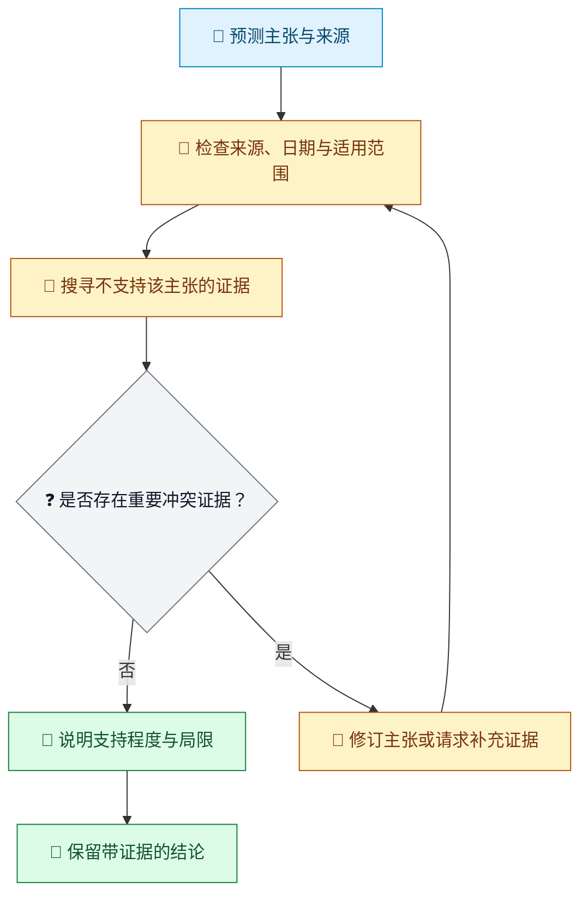

图例：📝 请求或结论草稿；🔎 研究；❓ 判断；🔁 返工；🧾 留存证据。

## 写下来不等于每次都做到

“继续挑战假设，直到没有关键漏洞”表达了意图，却不一定构成可重复的控制。作者可能认为“直到”意味着多轮；Agent 可能觉得搜过一次就足够，因为文本没有说明可观察的退出检查，也没有写出再次执行的路径。

看一个具体的写作审稿例子：

- 方法：找出缺乏支持的主张，并解释其影响。
- 未明确的执行细节：谁修订稿件、谁复核修订、出现什么结果才允许交付？
- 可观察的结果：带引用片段的问题清单、修订稿、第二轮审查，以及通过或未解决风险的记录。

Workflow 不能让审稿人永不出错，但可以让“第二轮复核没有发生”变得可发现。

## 先补结构，再加形容词

常见的修订方式是不断加入“认真”“全面”“深入”“不要遗漏”。这或许让指令语气更强，却不会自动多出一轮 Review。

| Skill 中的说法 | 仍未回答的执行问题 |
| --- | --- |
| “认真审查” | 应检查哪些证据？ |
| “再审一遍” | 什么结果会让工作返回复核？ |
| “持续到完成” | 哪个可观察条件代表完成？ |
| “必要时寻求帮助” | 哪种不确定性要交给人判断，人需要作出什么决定？ |

例如，安全审查要求做三轮却在第一轮后停止，那么细化第一轮清单不会自动创建第二、第三轮。先明确循环和退出条件，再完善每轮具体检查什么。

## 不只看最终答案，也要看过程

假设发布说明漏写了一项破坏性变更。有效的诊断会追问：变更记录是否不可用？提取步骤有没有运行？审查有没有将变更与 API 表面比较？检查失败后有没有返回修订的路线？这些是不同原因，应该采用不同修复方式。

结果不理想时，可以用这个简短追踪流程：

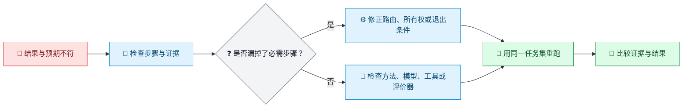

图例：🚧 已观察到的问题；🔎 检查；❓ 诊断；⚙️ Workflow 拥有的调整；🔁 重跑；🧾 对照证据。

## 本文所说的“稳定执行”

它指 Workflow 所拥有的步骤、分支、状态、循环与退出条件按定义得到处理；**不**表示随机性模型每次生成逐字相同的回答。质量仍受模型、输入、工具、外部证据、评价器和运行宿主影响。

基线可以帮助比较多次运行：哪些步骤发生了、哪些证据变了、结果得分如何。它是有效迭代的前提之一，不是科学可重复性的自动证明。

# Part 2：我认为自己没有 Workflow

## 思考过程里常常已有可重复结构

人们常把专家工作描述成“再想一想”或“改到满意为止”。把三次相似任务放在一起看，重复动作可能就清楚了。研究者可能先发现问题、提出解释、寻找反例、修订，再寻找反例。即使从未画过图，这已经包含一个循环。

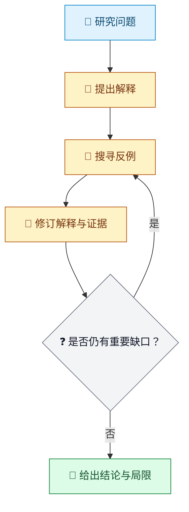

图例：📝 起始问题；🔎 分析；🔁 修订循环；❓ 退出判断；🧾 带局限说明的结论。

重点不是让每项任务完全相同，而是先命名重复出现的部分，再为不同情况保留分支。

## 不同案例可以走不同分支

想象一个客服团队处理退款申请。完整流程可以先检查订单、确认是否符合政策，并把例外交给人判断。缺少收据不该直接变成“拒绝退款”，而应走单独的补充信息分支。

| 情况 | 下一步 | 完成证据 |
| --- | --- | --- |
| 订单与资格信息明确 | 按政策作出处理 | 订单引用和决定理由 |
| 缺少必需信息 | 向客户询问缺失信息 | 尚未回答的具体字段 |
| 申请政策例外 | 暂停并交由人工复核 | 复核决定与理由 |

这是一条带分支的 Workflow，不是僵硬流水线。当现有证据不足以支持自动决策时，人工判断本来就应该是流程的一部分。

## 找出隐性 Workflow 的小练习

挑选三次最近的同类任务。每次记录输入、重复动作、检查失败后怎么办、谁执行每个动作，以及什么证据支持停止。再比较三次记录，只保留反复出现的结构。

例如，三次架构评审可能都从系统边界开始，识别高影响故障模式，验证风险最高的假设，最后给出风险判断。其中一次需要安全专家，另一次不需要。把这种差异表达成条件分支，不要强迫两种情况都执行无关步骤。

# Part 3：为什么 Prompt V37 仍然失败

## 更多文字不会凭空创建循环

更长的 Prompt 可以把方法说得更清楚，却无法单凭自身创建持久状态、重复转换、分支条件或审计记录。如果 Review 要发生三次，“请更全面”并不是执行方案。

用一个小例子看区别：

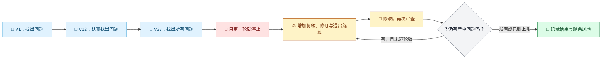

图例：📝 Prompt 修订；🚧 行为未变；⚙️ 结构性修正；🔁 重复路径；❓ 退出判断；🧾 结果记录。

## 修改之前先诊断失败类型

以翻译任务为例。如果关键术语不一致，可能需要补术语检查方法；如果术语检查根本没有执行，Workflow 需要设置必经步骤；如果检查执行了但术语表缺失，输入合同才是问题。这几种修复不能互相代替。

| 观察到的情况 | 优先检查的位置 | 一个有区分力的小检查 |
| --- | --- | --- |
| 必需检查完全没有出现 | Workflow 结构或宿主交接 | 查看运行轨迹中是否缺少该步骤 |
| 检查发生了，却漏掉已知术语 | Skill 方法、上下文或模型 | 附上术语表后重跑固定样例 |
| 检查无法读取来源 | 输入或工具合同 | 核实来源路径和权限 |
| 分数变化但正文未变 | 评价器或验收规则 | 将得分依据与实际改动对照 |

## 每次只改一个主要因素

更有效的顺序是：保留现有方法，让执行路线可观察；选取少量代表性任务；识别失败属于哪一类；修改对应层；用同一套评估重跑。如果同时改 Skill 和 Workflow，就更难知道是哪项改动起了作用。

例如，写作审稿流程漏掉第二轮复核，先补上并验证返回路线，再重写审稿标准。等两轮都能稳定发生后，再评估标准是否找到了预期问题。

# Part 4：Skill vs Prompt

## 当前请求与可复用方法解决不同问题

Prompt 通常说明当下要做什么；Skill 则沉淀可复用的流程和判断方式，包括何时适用、检查什么、可用哪些工具、什么结果算好。两者都可能是文本，也都可能加载到上下文里。单靠任一格式，都不能保证流程已被调度。

| 当前请求（Prompt） | 可复用的 Skill 指导 |
| --- | --- |
| “把这份产品发布公告翻译成日文。” | 保留产品名；不改写事实主张；检查敬语语域；核对数字与日期；标出源文歧义。 |
| “评审这份 API 方案。” | 检查兼容性、安全边界、故障模式和证据；区分事实与假设。 |

## 把同一任务说具体

一次性的翻译请求可以包含源文和目标读者。翻译 Skill 则可以补充可重复的检查清单。例如，源文说“可能在今年晚些时候推出”，Skill 应保留这种不确定性，而不是自行补成某个日历日期。若产品名属于受保护术语，则应保持原样。

一个简化的 Skill 大纲可以是：

```text
适用范围：翻译对外发布的产品或版本说明。
必须保留：产品名、数字、日期、承诺和不确定性。
检查内容：含义、术语、语域和本地表达规范。
需要标出：源文歧义；不得静默替作者消除歧义。
交付内容：译文和未解决问题清单。
```

这份大纲描述了方法。Workflow 仍需决定术语审查是不是独立步骤、缺少术语表时怎么办，以及由谁接受未解决的歧义。

## 根据要改的东西选择合适载体

如果一次请求缺少上下文，先补 Prompt；如果某个判断需要在许多任务中复用，完善 Skill；如果必需动作被跳过、分支错误或无法恢复，就检查 Workflow 和 Runtime 合同。一个任务可能需要调整多个层，但应有意识地分别评估。

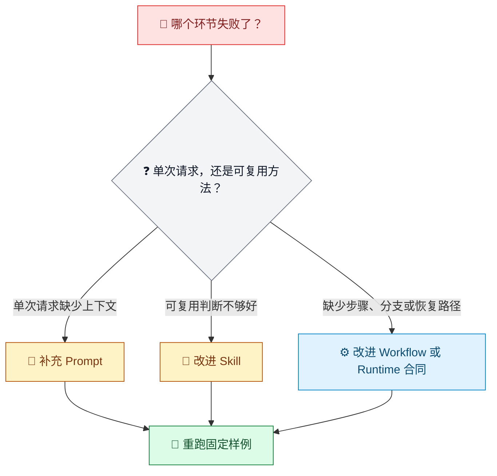

图例：🚧 已观察到的失败；❓ 路由判断；📝 当前请求；📜 可复用方法；⚙️ 执行控制；🧾 评估证据。

# Part 5：Skill vs Workflow vs Runtime

## 四层，四个问题

| 层 | 回答的问题 | 责任示例 |
| --- | --- | --- |
| Skill | 领域工作应该怎样做？ | 找出论证中缺乏支持的部分，并引用原文。 |
| Workflow | 以什么顺序执行，有哪些分支和退出规则？ | 审查；需要时修订；再次审查；通过或记录未解决风险。 |
| Runtime | 它拥有的流程怎样推进和持久化？ | 保存状态，在外部交接处暂停，并恢复同一实例。 |
| Model / Agent | 被委派的推理或生成工作怎样完成？ | 根据上下文与宿主工具，生成带证据的问题清单。 |

## 一次跨越各层的写作审稿

假设团队在发布前审查一份政策草稿。Skill 定义什么问题算重要；Workflow 安排审查、修订和再次审查；Runtime 保存草稿版本、问题发现和当前状态；Agent 在到达外部步骤时实际完成审查。

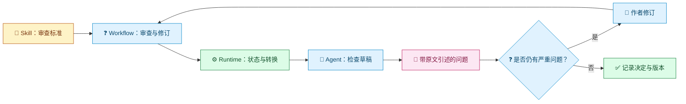

图例：📜 领域方法；❓ 流程判断；⚙️ 持久化进度；🔎 被委派的工作；🧾 证据；🔁 修订；✅ 已记录的完成状态。

除非明确把“政策论证是否有说服力”分配给经过验证的检查步骤，否则 Runtime 不会替团队作出这个判断。图也不能让 Agent 的审查自动正确；它只是明确所有权，并让证据可用于评估。

## 状态与证据不是一回事

运行可能正在等待外部审查、已完成两轮检查，或准备进入最终判断。这些属于执行状态。草稿、问题清单、审查理由和验收决定属于业务证据。系统应同时保留二者，不要把事件日志误当成当前业务输出。

例如，审查者标出“未说明数据保留期限”后，流程应保留原文片段与问题发现，把草稿交回修订，并让下一轮审查明确对应修订后的版本。若最后只剩一个“通过”状态，就很难评估过程。

## Loom 所说的执行脊梁

Loom 的执行脊梁，是围绕 Skill 所描述工作的 Workflow 结构：哪些步骤由 Runtime 拥有，哪些委派给模型、工具或人，失败后走向何处，何时算完成，以及怎样保留状态和证据。

SO CLI 或 MCP 入口负责承载执行；宿主 Agent 完成被委派的工作。CLI 提供较广泛的本地进程接入面。SO 也提供本地 stdio MCP，并可生成带版本信息的 VS Code `mcp.json` 和 Claude `.mcp.json` 配置。这是接入能力，不是对宿主无条件兼容的承诺；权限、工具、上下文和模型行为仍需验证。

# Part 6：Loom 落地示例

## 最简单的用法：在 Agent 中调用 Skill

面向使用者的最短路径是让 Agent 能读取目标 Skill 的 `SKILL.md`，再用一句明确请求调用 Skill 增强流程：

```text
[附加或选择目标 SKILL.md]
/loom-skill-enhancement this skill
```

在已安装 `/loom-skill-enhancement` 且能读取所选 Skill 的宿主中，这会请求 Loom 的 Skill 增强 Workflow 处理该 Skill。不同宿主可能把文件显示为附件、所选文件，或已经加载的 Skill。斜杠命令取决于宿主；它不是每种 Agent 都通用的 Loom 命令。

调用之后：

1. 回答流程提出的范围问题，并确认期望交付物。
2. 检查建议的 Workflow 和所需证据；流程需要确认时，作出相应审批或决定。
3. 继续完成实际 Workflow run 与所需的 resume，直到 Skill 交付物已经变更且产生最终完成证据。

不要把输入斜杠命令、compile 通过或收到 blocked 交接当作完成。模型与宿主仍负责被委派的工作；Loom 为这些工作提供受治理的路线和持久化执行。

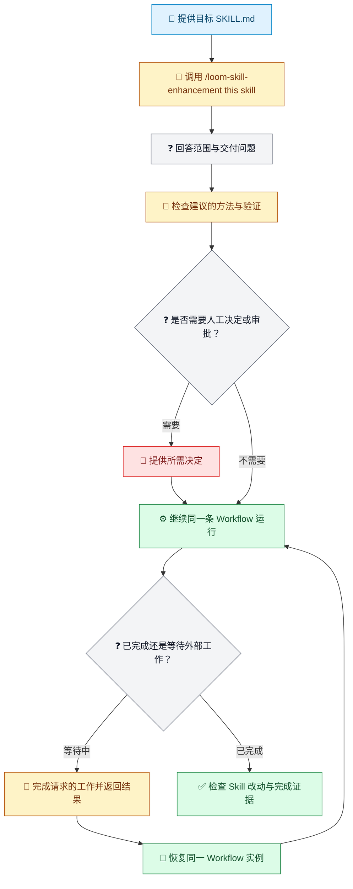

图例：📝 目标 Skill；🔎 调用或被委派的工作；❓ 问题或状态判断；📜 方法与检查；💬 用户决定；⚙️ Workflow 执行；🔁 恢复；✅ 已验证完成。

### 直接使用 SO CLI（可选）

对 Skill 作者来说，斜杠命令通常更简单。如果你要直接集成 SO，或检查更底层的 Workflow 合同，可以使用 CLI。先准备精确版本的已发布 SO Runtime 包，并读取它对应的 guide；不要从本文的流程示意图推导真实工作流格式。

以下命令展示生命周期，文件名是占位符，不是可直接复制运行的脚本。schema/demo 导出提供 Runtime 合同与演示文件，不会替你生成特定业务的 Workflow 实例。请按匹配版本的 guide 编写模板，并在运行相应命令前准备好外部 Workflow 实例、context 和需要恢复时的结果文件：

```bash
dotnet so.dll --guide
dotnet so.dll --schema-demo-output outputs/schema-demo
dotnet so.dll compile --workflow-file so-template.json --audit-output outputs/compile-audit
dotnet so.dll run --workflow-file workflow-instance.json --context-file context.json --operation-id run-001 --audit-output outputs/run-audit
dotnet so.dll resume --workflow-file workflow-instance.json --result-file resume.json --operation-id resume-001 --audit-output outputs/run-audit
dotnet so.dll status --workflow-file workflow-instance.json
```

读取 `--guide` 返回的 `guide_path`，根据匹配的 schema/demo 编写真实模板，再执行 compile。随后在同一个外部 Workflow 实例上 run/resume。若执行暂停在外部交接点，先完成所请求的工作，并提供结构化结果文件，再恢复流程。每个 `*-file` 参数指向的输入文件都必须在命令启动前完整写到磁盘。Compile 校验合同，不证明领域质量或最终任务已经完成。

## 一种可复用的 Loom 任务形态

设计时先从真实交付物开始，而不是为了画图而画图。写清输入、业务输出、可能阻止交付的检查、外部工作，以及需要保留的证据；随后再判断哪些步骤由 Runtime 拥有，哪些需要 Agent 或人来做。

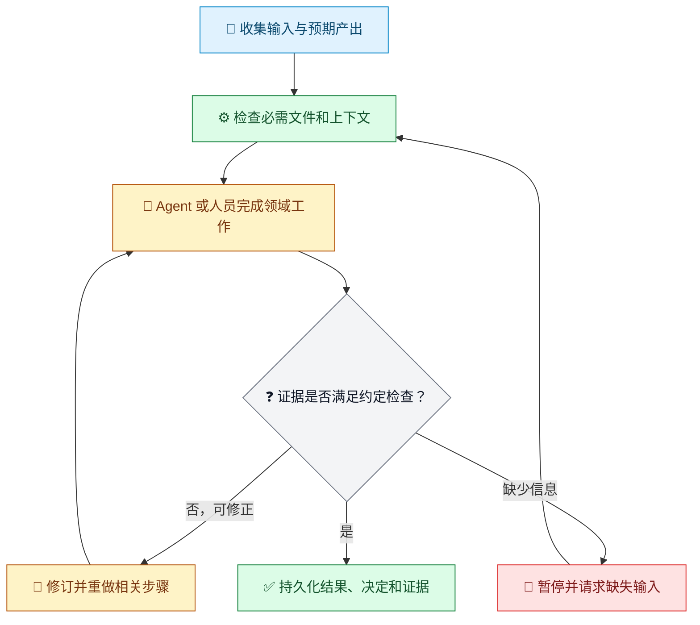

图例：📝 输入；⚙️ Runtime 拥有的工作；🔎 被委派的工作；❓ 检查；🔁 返工；🚧 暂停；✅ 完成。

这是流程示意，不是可直接复制的 SO 工作流 JSON。真实字段和模板应按所选运行时的 `--guide`、schema/demo 导出与 `compile` 命令验证。

## 示例：写作审稿

- **Skill：**找出论证漏洞、证据不足、范围不清和反例；引用相关段落并说明影响。
- **Workflow：**载入带版本的草稿，请求审查；将严重问题交给作者修订；再次审查修改后的版本；达到明确通过条件或迭代上限时结束。
- **Runtime：**保留当前版本、问题发现、外部交接与完成决定；审查结果返回后恢复同一实例。

一个可用的通过条件可以要求“没有未解决的严重问题”，而例外必须由人决定。“看起来不错”本身不是充分证据。

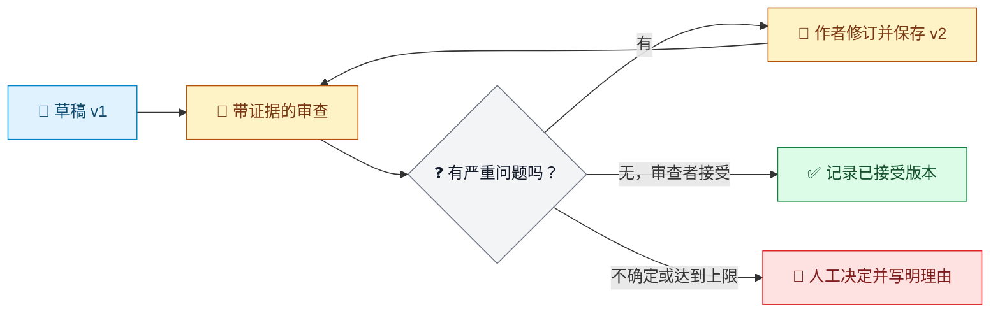

图例：📝 带版本的输入；🔎 审查；❓ 门槛；🔁 修订循环；✅ 接受结果；🚧 人工决定。

## 示例：翻译质量检查

翻译 Skill 可以要求保留原意、统一术语、符合目标地区语域，并明确处理歧义。Workflow 可以先翻译，再核对保护术语；发现具体缺陷时请求修订；若源文自身含糊，则暂停请求人工判断。

例如，英文源文写着“可能在今年晚些时候推出”，译文不能把它变成一个确定发布日期。应保留的证据包括源文片段、译文片段，以及发给产品负责人的问题。

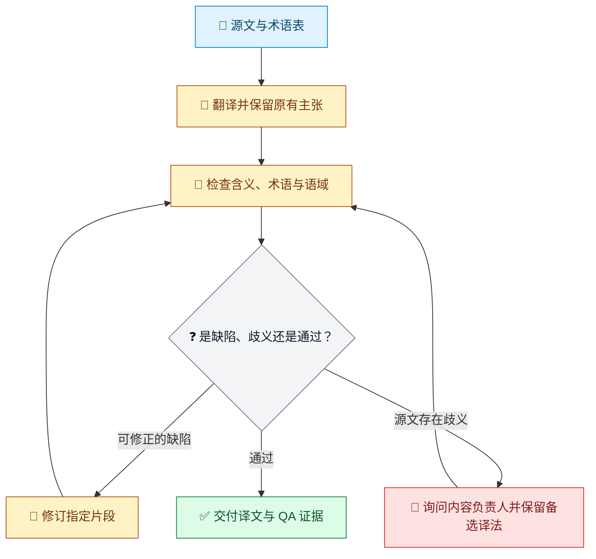

图例：📝 源文；🔎 翻译与检查；❓ 结果判断；🔁 修订；🚧 负责人决策；✅ 交付。

## 示例：架构评审

有用的架构评审不会试图证明某个设计“绝对安全”，而是识别高影响故障模式，区分已验证事实和假设，并记录仍不确定的内容。若缺少关键部署约束，流程应该询问，而不是悄悄假设一个值。

最终交付可以包括风险、受影响边界、支持证据、严重度理由、缓解方式、责任人和未解决问题。Runtime 能保存这份材料和审查状态；领域判断仍属于审查者和评价者。

## 接入方式与平台边界

- SO CLI 提供 `compile`、`run`、`resume` 等命令。能够启动对应可执行文件、传递路径输入并读写约定文件的宿主可以调用它。
- SO 提供本地 stdio MCP 和 VS Code、Claude 配置生成。这不代表所有 Agent 都有 MCP 客户端。
- Runtime 包发布 8 个 RID：`win-x64`、`win-arm64`、`linux-x64`、`linux-arm64`、`linux-musl-x64`、`linux-musl-arm64`、`osx-x64`、`osx-arm64`。它们描述 CLI 的运行平台，不是受支持模型名单。
- 模型调用和宿主工具由接入方提供。更换 Agent 或模型时，应验证外部步骤合同、权限、可用上下文、工具和返回结果。

简而言之：CLI 是适用于兼容 shell-capable 宿主的宽泛接入面；已提供的 MCP 配置格式是 VS Code 与 Claude；已发布 Runtime 包覆盖上述 8 个 RID。这些事实都不保证每种宿主/模型组合行为一致。

# Part 7：Loom Before / After

## Before：流程散落在对话里

团队可能已经有一份认真编写的审稿 Skill，却仍让每次 Agent 自行决定审几轮、问题是否严重。一次运行可能审两遍，另一次可能只审一遍就交付。方法存在，但路线和证据散落在对话里。

## After：路线和证据明确可查

针对同一项写作审查，Workflow 可以保留草稿版本、要求提交审查结果、把严重问题路由到修订、再次审查，并记录停止原因。Agent 仍然负责审查；Loom 在周围提供声明好的执行结构和持久状态。

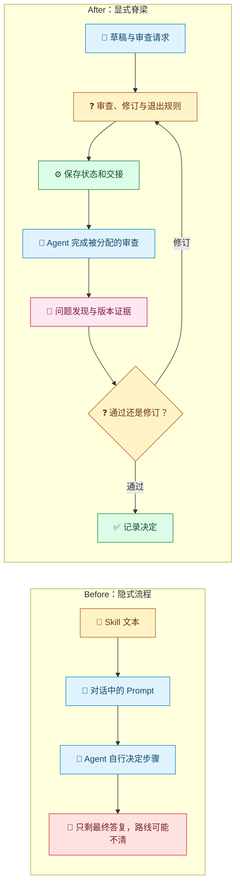

图例：📜 可复用方法；📝 任务输入；🔎 被委派的审查；❓ Workflow 或退出判断；⚙️ 持久化执行；🧾 证据；🚧 不清晰的结果；✅ 已记录完成。

| 观察点 | 隐式流程 | 显式 Workflow 脊梁 |
| --- | --- | --- |
| 重复审查 | 依赖提醒或 Agent 自行决定 | 重复路线被明确表达并可追踪 |
| 失败处理 | 发现问题后可能直接停止 | 问题可进入修订、补证据或人工判断 |
| 长任务 | 状态散落在多条消息中 | 可以恢复同一个 Workflow 实例 |
| 证据 | 通常只留下最终回答 | 可检查版本、问题发现、状态与决定 |
| 质量 | 可能波动 | 过程更可观察；答案质量仍需评估 |

改进不是“从此不再失败”，而是“路线、停点和证据可查，因此更容易发现遗漏”。

# Part 8：与其他方案的区别

## SkillOpt 改进 Skill 文本；Loom 组织执行

Microsoft SkillOpt 把一份自然语言 Skill 文档作为固定目标 Agent 的可训练状态：目标模型和执行 harness 保持不变，优化器根据评分轨迹提出有界文本改动，再由留出验证集筛选候选版本。论文报告在六个基准、七个目标模型和三种执行模式的 52 个测试单元上取得最好或并列最好结果。这是论文范围内的结果，不是对任意业务或宿主的保证。

例如，客服 Skill 经常给出不完整的故障排查建议。若团队有带评分的轨迹和固定 harness，SkillOpt 或许能帮助改进 Skill 文本。如果工作还要求执行诊断步骤、走升级分支并保留证据，Loom 解决的是 Workflow 结构。二者可以互补，但任何一方都不会自动生成另一方的交付物。

| 比较轴 | Microsoft SkillOpt | Techne Loom / SO |
| --- | --- | --- |
| 主要对象 | 单份 Skill 文档的离线优化 | Workflow 结构、Runtime 状态和证据 |
| 过程 | 评分轨迹、有界编辑、留出验证 | 编译合同、运行 Workflow、交接与恢复 |
| 主要产物 | 被选中的 `best_skill.md` | 可检查的 Workflow 执行、状态与审计证据 |
| 适用前提 | 固定 Agent 配置，并有评分或验证器 | 任务需要明确步骤、交接和持久状态 |

## Python 与 LangGraph 也能构建持久化 Workflow

Python 并非天然临时或不可靠。正确配置 checkpointer 与应用后，LangGraph 支持图节点、条件边、循环、人工中断、持久化和恢复。

例如，某团队已有 Python 服务，并已在数据库保存审查状态、模型调用、认证和监控，那么继续沿用代码库可能更简单。如果团队希望 Workflow 实例和执行合同成为独立、可移交的资产，则可以评估 Loom 的文件化 SO Runtime 合同。

| 比较轴 | Python / LangGraph 风格 | Loom / SO |
| --- | --- | --- |
| 流程资产 | 应用代码、graph/state 和依赖 | 可序列化 WorkflowInstance、schema、模板与独立 Runtime 包 |
| 恢复 | 由 checkpointer 和应用配置负责 | SO 对同一个外部 Workflow 实例执行 run/resume |
| 接入 | 应用自行选择模型与基础设施 | CLI 接入面与 VS Code/Claude MCP 配置生成 |
| 取舍 | 灵活并贴近 Python 生态；应用负责存储与运维 | 在 .NET SO Runtime 合同下使用可移交的 Workflow 资产 |

另有一个名称相近的 Python 项目 [BambooGap/skills-orchestrator](https://github.com/BambooGap/skills-orchestrator)。其 README 将自身定位为 Skill 治理和交付层，提供策略校验、证据/SBOM、CI 与 MCP 集成；README 也说明它不替代 Agent Runtime、不评估模型推理。它是相邻的 SkillOps 项目，不属于通用模型 Workflow Runtime 的同一产品类别。

## 按需要解决的问题选择

一个简单的选择例子：

- 如果流程没问题，只是可复用指令不清晰，就改进并评估 Skill；若已有评分轨迹和固定目标环境，可进一步评估 SkillOpt。
- 如果工作已经嵌入带持久状态的 Python 服务，就比较扩展现有应用与引入独立 Runtime 的成本。
- 如果任务需要可序列化合同、明确交接和独立于聊天的恢复能力，就评估 Loom/SO。
- 如果要求每种宿主/模型组合行为等效，以上产品名称都不能证明这一点；需要定义并执行兼容性测试矩阵。

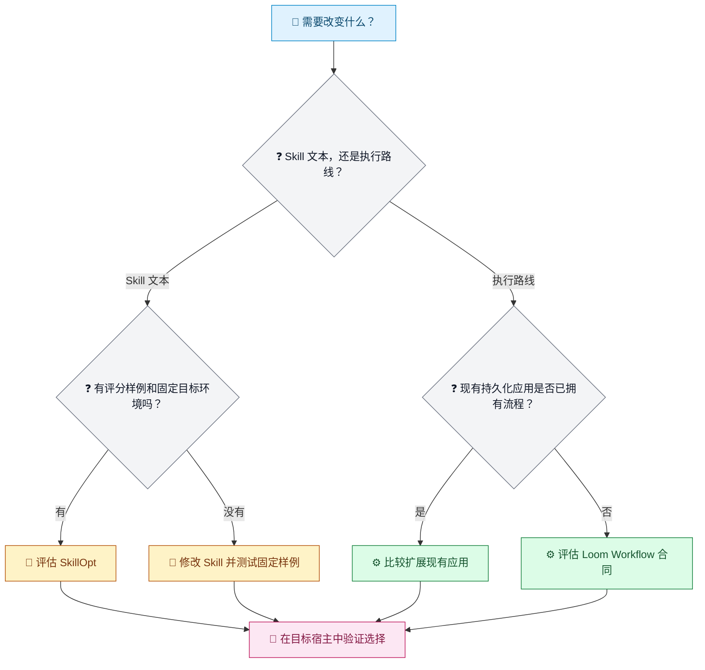

图例：📝 需求；❓ 选择；🔎 研究/优化；📜 方法；⚙️ 执行方案；🧾 目标宿主验证。

## 准确描述平台边界

“多平台支持”可能指不同内容：

1. **Runtime 包的操作系统和架构覆盖：**SO Runtime 包清单列出 8 个 RID。
2. **Agent 接入方式：**兼容宿主可调用通用 CLI；本地 stdio MCP 配置生成格式为 VS Code 和 Claude。
3. **所有宿主与模型上的 Skill 行为等效：**没有这样的承诺。Skill 发现、上下文加载、权限、工具以及模型遵循指令的方式，都依赖具体宿主与模型。

“可复用”是指兼容宿主能够使用同一份 Workflow 合同，同时由接入方验证自身能力；它不表示任意 Agent 都能一键接入。

# Part 9：FAQ

## 我认为自己没有 Workflow，怎么办？

比较三次相似任务。如果其中有重复动作、判断、返工或停止点，就把它们写下来。例如，每次事故复盘都确认影响范围、检查日志、验证可能原因，并在证据缺失时升级处理，那么你已经有 Workflow 雏形。保留具体案例的分支，不要假装每次事故都相同。

## 我已经有很多 Skill，应从哪里开始？

选一份使用频繁、结果可观察的 Skill。例如，发布说明 Skill 的结果可以用“草稿是否包含所有用户可见 API 变化和破坏性变更”来检查。追踪一次成功运行和一次失败运行，找出被跳过或执行较弱的步骤，先修对应层。

## 什么时候优化 Skill？

当 Workflow 与评价方法足够稳定，可以用同一任务集比较不同版本时。如果术语检查被跳过，应修流程；如果检查发生了，却反复误处理已知术语，则应改进 Skill、术语表、模型上下文或评价器。比较时保持样例集不变。

## Loom 会替我写 Skill 吗？

不会。Loom 能把方法组织成执行过程，领域专家仍负责整理并维护方法。例如，Runtime 可以要求安全审查通过后才允许完成，但风险审查应该识别什么仍须由专家定义。

## Loom 能提高质量吗？

它可能通过明确步骤、循环和证据间接减少遗漏，并让质量更容易评估，但不保证答案正确。如果一条 Workflow 忠实地重复了薄弱的审查方法，结果仍可能很差。

## 同一份 Workflow 能在不同 Agent 和模型上运行吗？

CLI 和已发布 RID 提供了较广的接入基础，SO 也生成面向 VS Code 与 Claude 的本地 stdio MCP 配置。每个宿主仍须能够调用 Runtime 或加载 MCP。更换模型、工具、权限或上下文后，要验证外部步骤结果。入口受支持不等于做过等效性测试。

## 第一个实验怎么做比较合适？

挑一个重复性任务，定义一个业务输出和一项检查，再记录小规模基线。例如，抽取五次过去的架构评审，检查每份是否为影响最大的三项风险提供了证据。只增加缺少的 Workflow 步骤，再用同样五个案例重跑，并分别比较完成证据与评审质量。

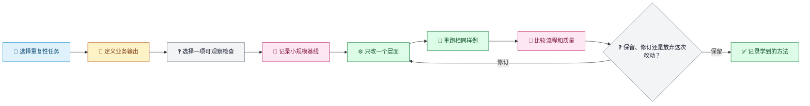

图例：📝 任务；📜 输出合同；❓ 检查或决定；🧾 基线；⚙️ 受控改动；🔁 重跑；🔎 比较；✅ 记录所得经验。

## 结语：Skill 的执行脊梁

> 案例提供经验来源。
>
> Skill 把经验组织成方法。
>
> Workflow 把方法组织成有步骤、有循环、有边界的工作。
>
> Loom Runtime 为这些工作提供持久化执行脊梁；Agent 与模型完成交给它们的外部工作。

你以为自己缺的是更多 Skill 文本，真正需要的也许是让现有方法能够在兼容的 Agent/model 入口下被组织、推进、恢复和检查。先搭一条小而可测试的脊梁，再根据证据判断下一步该优化 Skill、工具、模型、评价器还是 Workflow。

## 参考资料

- [Microsoft Research：SkillOpt: Agent skills as trainable parameters](https://www.microsoft.com/en-us/research/blog/skillopt-agent-skills-as-trainable-parameters/)
- [SkillOpt 源码仓库](https://github.com/microsoft/SkillOpt) 与 [论文 arXiv:2605.23904](https://arxiv.org/abs/2605.23904)
- [LangGraph：Workflows and agents](https://docs.langchain.com/oss/python/langgraph/workflows-agents)、[Persistence](https://docs.langchain.com/oss/python/langgraph/durable-execution)、[Interrupts](https://docs.langchain.com/oss/python/langgraph/interrupts)
- [Microsoft Agent Framework：Workflow capabilities](https://learn.microsoft.com/en-us/agent-framework/workflows/)
- [BambooGap Skills Orchestrator](https://github.com/BambooGap/skills-orchestrator)
- Loom：[Skill Interoperability](../architecture/skill-interoperability.md)、[SO Guide](../guides/so-guide.md)、[CLI Reference](../reference/cli.md) 与 [Runtime Package Index](../../../packages.beta.md)

研究核对日期：2026-09-23。产品功能和包覆盖范围依据所链接的公开来源及本仓库已发布的包文档；依赖具体版本或宿主接入时，请重新核实当前状态。
