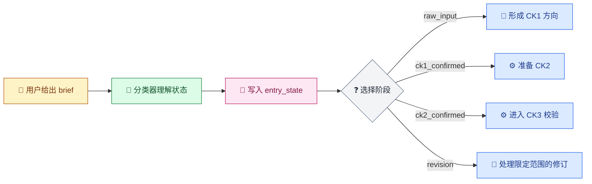
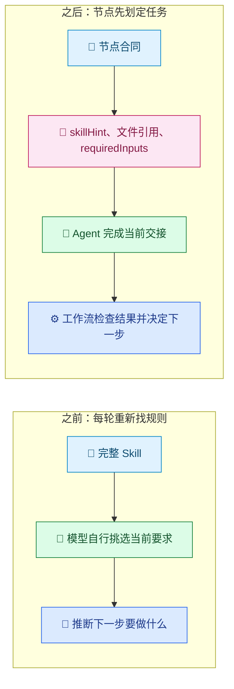
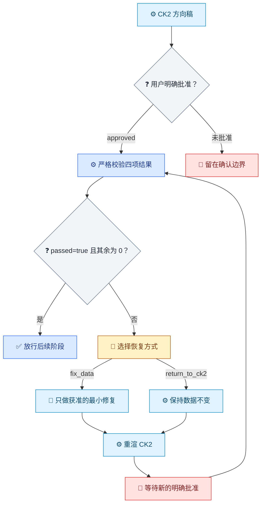

[English](../../en/articles/skill-unchanged-rules-gated.md) | [文章与博客](README.md)

# 业务规则没有重写，执行边界有了门禁

> 一份成熟的 Moodboard Skill 接入 Techne Loom 后，变化发生在哪里？

**后续篇：**本文接续[《Skill 已经有了，为什么 AI 还是不听话？》](skill-execution-engineering.md)，把“写下的方法有没有进入完整、可观察的执行过程”落到一个具体案例。


## 开场：写下规则之后，还差哪一步

客户给出三个词：“高级、温暖、电影感。”这些词将影响后续创意讨论与执行投入。方向尚未对齐就开始制作，可能带来整轮返工。Moodboard Alignment 将抽象感受整理成可讨论、可确认、可交付的项目方向。

Moodboard Alignment 的 Skill 已经把阶段规则写得明白：先判断项目所处状态；CK1 确认方向后进入 CK2；CK2 得到明确批准后才进入 CK3；revision 只修改用户点名的部分。接入后的关键问题是，怎样让每次交接都能依据当前规则推进，并清楚标出停点与所需证据。

首尾比较显示，`scripts/`、`examples/`、README 和用户指南都保持原样。治理提交集中在执行层：原本需要模型每轮从 Prompt 中记取的部分规则，被写进可编译、可审查、可追踪的工作流节点与门禁。

本文将 `d941cec` 作为历史比较终点，统计仅覆盖 `4c2f727` 至 `d941cec`；之后的提交不计入这组数据。这样可以对应当时的工作流配置与验证记录。

| 比较口径 | 结果 |
|---|---|
| 首次提交 | `4c2f727`，2026-06-23，`Initial release of moodboard-alignment` |
| 比较终点 | `d941cec`，2026-09-28，`Remove planning-only skill plan` |
| 首尾净差异 | 10 个文件，增加 1,459 行、删除 2 行 |
| 逐提交累计改动 | 根提交之后 7 个提交，累计增加 1,936 行、删除 479 行 |
| 未变化的项目文件 | `scripts/`、`examples/`、`README.md`、`USER_GUIDE.md` 均无首尾差异 |

[查看 `4c2f727` 到 `d941cec` 的完整比较](https://github.com/waynebaby/moodboard-alignment-loomed/compare/4c2f727e4e8426bdf016880c34b03cfc793b4e9c...d941cec467df82ffb8c5dadaa0080e5ae409f2b7)。净差异和累计改动量是不同口径：规划文件曾在中间提交中加入、修改，之后又移除，所以累计行数不会等于首尾净差异。

## 一、原作者已经把关键约束写得很完整

Moodboard Alignment 初版 Skill 已经是一套成熟的业务规约，明确规定了阶段、授权、数据所有权和修改范围。原作者把这些产品判断写成了具体、可执行的指引。

**HARD ROUTER 先判断业务状态，再组织回复。**它要求每次只选一个状态，并规定模板优先于表达风格。面对模糊 brief、方向确认或局部修订，Agent 按当前阶段给出对应内容。

**每个阶段都有允许做的事，也有明确禁区。**`raw_input` 可以理解方向、提出有限问题，但不能抢跑生成最终视图；CK1 只形成待确认方向；CK2 完成并获批后，才轮到 CK3。即使输出“更完整”看起来更有帮助，越过阶段也仍然是错的。

**每次确认都有明确范围。**CK1 批准后进入 CK2；CK3 需要用户看过或收到 CK2 后再次明确批准。每个确认点都对应具体阶段与交付内容。

**`data.json` 是共同真相源，revision 是小范围修改。**只改用户点名的节点、图片或维度；缺少项目路径、当前数据或原节点内容时先补上下文；没有被授权的字段保持不动。

具体的 FAIL FAST 反例、六个审美维度，以及面向不同受众的 `client`、`director`、`execution` 视图，共同构成了成熟的产品方法：团队可以依据项目类型组织审美判断、数据和交付。

本文聚焦这些成熟规则如何进入每一轮执行：工作流将当前状态、交接输入和继续条件明确下来，让模型按节点处理当前任务。

## 二、把状态从对话里搬进工作流

原始 Skill 的 HARD ROUTER 由模型理解用户意图；接入工作流后，模型仍负责分类，但它不再独自决定后续所有步骤。分类结果写入 `entry_state`，表达式再按这个状态选择路线。



图例：💬 用户输入；🔎 模型分类；🧾 状态证据；❓ 确定性判断；📜 业务阶段；⚙️ 运行时步骤；🔁 修订路径。

状态分类仍由模型完成。分类结果写入 `entry_state` 后，表达式依据该值选择下一条路线，减少每轮从 Prompt 中重新判断路线的需要。工作流实例保存当前状态，`.events.jsonl` 记录各次转换，方便审阅者沿着事件检查执行过程。

## 三、每一步只拿到这一步需要的上下文

Skill 可以很完整，但把整份业务规约反复交给每个节点自行筛选，仍然让 Agent 承担额外的注意力工作。Loom 的变化，是让节点先声明这次交接要做什么、需要哪些输入、应引用哪些文件。



图例：📜 方法与节点合同；🔎 模型执行；💬 对话中的自行推断；🧾 明确输入；⚙️ 运行时控制。

| 节点示例 | 节点预先声明什么 | 这能减少什么歧义 |
|---|---|---|
| 生成 CK1 | 使用哪份 Skill 规则、允许输出什么、哪些动作禁止 | 不把 CK1 提前写成最终方案 |
| 渲染 CK2 | `dataSchemaRef`、`workflowCommandsRef` 和 `project_root` 等输入 | 知道要读哪些项目资料、在哪里生成待确认方向 |
| 严格校验 | `scriptPath`、`project_root`，以及不得修改 `data.json` | 校验节点不顺手改业务数据 |
| 应用 revision | 修订范围、目标值和当前数据 | 未点名的节点与字段保持原样 |

节点间的 `memory_for_next_step` 按 memory key 选择后续交接内容；没有匹配项时，不会回退为完整 context。下游节点据此接收与当前任务相关的信息。

节点化输入可能降低窄任务对上下文与注意力的要求。这是基于机制的推论，本文没有模型对照实验。可以直接观察到的变化是：任务范围、文件依据和输入责任都写进了节点合同。

## 四、把边界写成真正会拦下来的门禁

**批准值直接控制阶段推进。**CK1 与 CK2 的 WaitResume 只有在结构化结果中的 `approval_decision` 精确等于 `approved` 时才继续；CK1 确认对应 CK2，CK3 仍需要 CK2 之后的新确认。

**严格校验逐项检查四个结果字段。**模板要求 `passed`、`exit_code`、`errors`、`warnings` 均存在且类型正确，值分别为 `true`、`0`、`0`、`0`。任一字段缺失、类型错误或数值不符合要求，都会进入恢复路线。



图例：💬 用户选择；❓ 检查条件；⚙️ 运行时动作；🔁 有限修复；🚧 等待确认；✅ 条件满足后放行。

这里的恢复路线同样保护用户授权：`fix_data` 只允许按诊断做最小修复；`return_to_ck2` 明确保持数据不变。两条路都会重新渲染 CK2，并等待用户新的明确批准后再重试校验。

在 `0.3.318` 验证矩阵中，单条 warning 已足以让校验回到 CK2 恢复边界。该结果来自测试夹具。

## 五、完成状态由业务文件与审计记录共同证明

编译结果说明模板通过结构与合同检查；要解释一次运行怎样抵达完成，还需要能按步骤核对的文件。`0.3.326` 版本锁要求启动前通过八项包检查：包 ID、精确版本、RID、SHA-512、nuspec、runtime manifest、归档安全，以及 apphost 和英文 guide。实际运行的审计记录还能回答三个问题：在哪一步暂停、收到什么恢复结果、最后停在哪个状态。

### 业务步骤留下什么

下表列出节点映射与脚本命令声明的项目产物，并结合后续 `.326` 本地运行中的 resume 输入说明交接。路径是项目内的相对路径；审计快照另行统计。

| 步骤 | 项目文件或交接记录 | 用途 |
|---|---|---|
| 状态分类 | `resume-classification.json`、`resume-classification-projected.json`；`entry_state` | 保存分类结果及写入 workflow context 的状态 |
| CK1 / CK2 | `resume-ck2-render.json`、`resume-ck2-approved.json`；`data.json`、`ck2-client.html`、`ck2-execution.html` | 形成待确认方向、渲染两种确认视图并记录批准 |
| 严格校验与恢复 | `resume-validation-report.json`、`resume-validation-recovery-prompt.json`、`resume-recovery-fix-data.json`、`resume-validation-repair-report.json`、`resume-ck2-recovery-render.json`、`resume-ck2-recovery-approved.json`、`resume-validation-passed.json` | 记录首轮报告、恢复选择、复核、重新渲染和新批准 |
| 图像 / 音频 | `images/`、`audio/` | 本次交付使用图片 placeholder；没有生成音频文件 |
| 最终渲染 | `index-client.html`、`index-director.html`、`index-execution.html`；`resume-final-render.json`、`resume-final-render-projected.json` | 交付三种受众视图并保存最终交接结果 |

分类器返回字段片段：

```json
{
  "entry_state": "raw_input",
  "project_type": "film",
  "has_revision_context": false,
  "keywords": ["高级", "温暖", "电影感"]
}
```

`data.json` 节点字段片段：

```json
{
  "meta": { "project_type": "film", "sound_enabled": false },
  "summary": { "one_sentence": "暖色调、克制运动的开场方向" },
  "timeline": [
    {
      "id": "node-opening",
      "label": "Opening",
      "emotion": { "intensity": 4 },
      "image": { "url": "images/node-opening.png", "status": "placeholder" }
    }
  ]
}
```

### 审计文件怎么数

后续 `.326` 业务运行的 workflow history 有 34 条记录，`workflow.json.events.jsonl` 也有 34 条事件，最终到达 `state.done`。run-audit 中有 20 个审计快照目录；每个目录包含同一组 5 个文件：`workflow.analysis.json`、`workflow.dataflow.json`、`workflow.html`、`workflow.json`、`workflow.mermaid.md`。

| 快照类型 | step 序号 | 快照数 | 每个快照的审计文件数 |
|---|---|---:|---:|
| blocked `SubagentCall` | `0002`, `0004`, `0007`, `0011`, `0014`, `0019`, `0021`, `0025`, `0028`, `0030`, `0032` | 11 | 5 |
| blocked `WaitResume` | `0009`, `0016`, `0023` | 3 | 5 |
| progress | `0006`, `0013`, `0018`, `0027`, `0034` | 5 | 5 |
| completed | `0034` | 1 | 5 |
| **run-audit 合计** | **20 个快照目录；序号 `0034` 有 progress 与 completed 两份** | **20** | **100** |

compile 有一个独立的 `step-0001-compiled` 快照，包含 6 个文件：`workflow.analysis.json`、`workflow.compile-feedback.json`、`workflow.dataflow.json`、`workflow.html`、`workflow.json`、`workflow.mermaid.md`。compile 与 run-audit 共 **106 个审计文件**：ZIP 包含 102 个，以下 4 个关键快照文件作为独立附件提供，不在 ZIP 内。

附件：[执行审计与结果 ZIP](../../assets/attachments/moodboard-alignment-0.3.326/moodboard-alignment-0.3.326-audit-results.zip)；CK2 等待确认（step-0009）的 [Mermaid 图](../../assets/attachments/moodboard-alignment-0.3.326/step-0009-blocked-WaitResume.mermaid.md) 与 [workflow 状态文件](../../assets/attachments/moodboard-alignment-0.3.326/step-0009-blocked-WaitResume.workflow.json)；最终完成（step-0034）的 [Mermaid 图](../../assets/attachments/moodboard-alignment-0.3.326/step-0034-completed.mermaid.md) 与 [workflow 状态文件](../../assets/attachments/moodboard-alignment-0.3.326/step-0034-completed.workflow.json)。

两个快照展示了门禁怎样留下可复核的状态。`step-0009-blocked-WaitResume/workflow.json` 中，CK2 确认尚未返回：

```json
{
  "status": "waitingExternal",
  "currentNodeId": "state.wait_ck2"
}
```

`step-0034-completed/workflow.json` 则记录最终状态：

```json
{
  "status": "succeeded",
  "currentNodeId": "state.done"
}
```

compile 快照中的 `workflow.compile-feedback.json` 记录版本和诊断计数：

```json
{
  "runtime_version": "0.3.326",
  "status": "succeeded",
  "counts": { "total": 0, "errors": 0, "warnings": 0 }
}
```

一份 `workflow.json` 快照说明当时的状态；`analysis`、`dataflow`、HTML 与 Mermaid 分别保留检查、连接和可读流程视图。被挡住的快照能显示用户确认尚未返回，后续快照则记录恢复经过和完成状态。这样，审计把门禁的停点、恢复路径与最终结果连成一条可以逐份回看的证据链。

时间点也要分清：`d941cec` 的治理记录当时把 public run/resume 记为 pending；这条 `.326` 本地业务运行发生在之后。审计目录保存在执行环境，没有随 `d941cec` 提交到治理仓库。

## 对已经写好 Skill 的作者意味着什么

Loom 接入可以从复用既有业务规约开始。Moodboard 案例首尾范围内的项目脚本、示例、README 和用户指南都保持原样；工作流补充了状态、交接输入和继续条件的表达。

接入需要工程工作：把边界整理成节点、输入合同、表达式和验证证据，并确认调用方能够执行外部工作、返回约定结果。模型继续理解 brief，创意团队继续判断方向；Loom 负责提供可审查的执行路线。

Skill 说明团队如何开展业务工作；工作流明确每一步的输入、交接与继续条件。这些内容为每轮执行提供了可检查的依据。

## 结语：让已有规则更难被质疑

成熟 Skill 的价值，体现在业务判断能够进入每一次交接：谁确认了方向？下一步需要哪些输入？什么证据支撑流程继续？这些问题都有对应的规则与记录可查。

在本文统计的首尾范围内，Moodboard Alignment 的项目脚本、示例和用户文档保持原样；新增的治理配置把部分执行条件纳入工作流。读者可以据此检查规则位置、门禁条件和已验证到的阶段。

[Moodboard Alignment README](https://github.com/waynebaby/moodboard-alignment-loomed/blob/d941cec467df82ffb8c5dadaa0080e5ae409f2b7/README.md) 描述了项目如何把创意方向变成可协作的交付。工作流为这套业务方法补充了可检查的交接，审美判断仍由模型与创意团队完成。

## 边界：事实、推论与未验证项

- **首尾事实：**`4c2f727` 到 `d941cec` 共 10 个变化文件，净差异为 `+1,459/-2`；根提交之后 7 个提交的累计变更为 `+1,936/-479`。`scripts/`、`examples/`、README 和用户指南均无差异。
- **运行时证据：**后续本地 `.326` run/resume 到达 `state.done`；逐步审计计数见上节。`.318` 矩阵仍是测试夹具证据。
- **尚未测量：**没有模型分类准确率、成功率、速度或 token 成本对比；图片使用 placeholder，未生成音频。
- **合理推论：**节点化输入与范围限制可能降低单次任务的注意力负担，但本案例没有模型能力对照实验。
- **统计范围：**本文刻意把 `d941cec` 作为历史比较终点，不代表该仓库当前 HEAD，也不把后续提交混入这组首尾数字。

## 附：文件索引

| 首尾变化文件 | 状态 |
|---|---|
| `.gitignore` | 修改 |
| `SKILL.md` | 修改 |
| `assets/agents/moodboard-alignment-ck-state-classifier.agent.md` | 新增 |
| `assets/so-workflow/contract.json` | 新增 |
| `assets/so-workflow/governance-notes.md` | 新增 |
| `assets/so-workflow/node-to-file-map.md` | 新增 |
| `assets/so-workflow/so-package-lock.json` | 新增 |
| `assets/so-workflow/so-template.json` | 新增 |
| `references/workflow-commands.md` | 修改 |
| `skills-lock.json` | 新增 |

**Techne Loom 相关背景：**[执行模型（中文）](../architecture/execution-model.md) | [执行模型（English）](../../en/architecture/execution-model.md)。

## 参考资料

- [上一篇：Skill 已经有了，为什么 AI 还是不听话？](skill-execution-engineering.md)
- [Moodboard Alignment 首尾比较：`4c2f727` 到 `d941cec`](https://github.com/waynebaby/moodboard-alignment-loomed/compare/4c2f727e4e8426bdf016880c34b03cfc793b4e9c...d941cec467df82ffb8c5dadaa0080e5ae409f2b7)
- [Moodboard Alignment README（比较终点版本）](https://github.com/waynebaby/moodboard-alignment-loomed/blob/d941cec467df82ffb8c5dadaa0080e5ae409f2b7/README.md)
- [Moodboard Alignment `SKILL.md`（比较终点版本）](https://github.com/waynebaby/moodboard-alignment-loomed/blob/d941cec467df82ffb8c5dadaa0080e5ae409f2b7/SKILL.md)
- [Loom 执行模型](https://github.com/waynebaby/Techne-Loom/blob/main/docs/zh-cn/architecture/execution-model.md)
