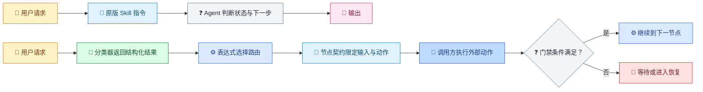
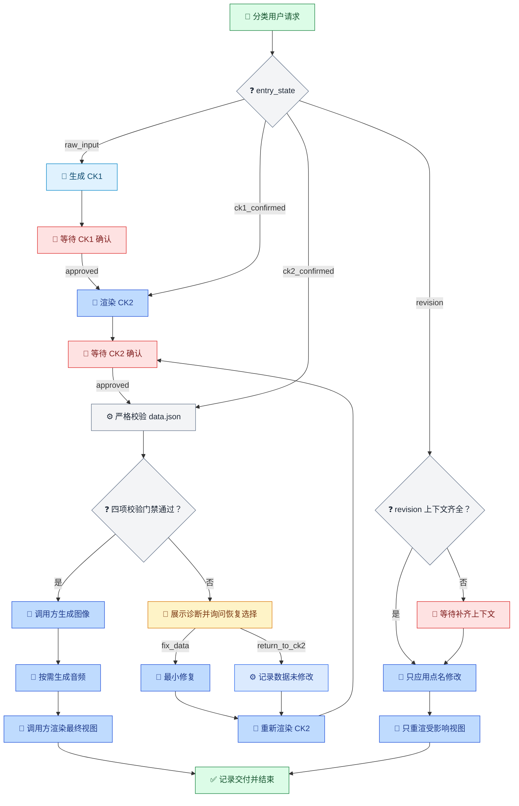

[English](../../en/articles/skill-unchanged-rules-gated.md) | [文章与博客](README.md)

# 业务规则没有重写，执行边界有了门禁

> Moodboard Alignment 如何把一部分状态、输入和完成条件纳入可审查的运行时工作流

**后续篇：**本文接续[《Skill 已经有了，为什么 AI 还是不听话？》](skill-execution-engineering.md)，把“写下的方法是否进入完整、可观察的执行过程”这个问题，落到一个具体案例。

## 项目背景：审美对齐不只是生成图片

Moodboard Alignment（审美共识引擎）面向客户、创意负责人和执行团队。它接收 brief、会议记录、剧本、品牌文档、PPT 大纲、App/游戏设定等材料，把“高级”“温暖”“电影感”等抽象词拆解为 emotion、motion、color、composition、style、sound 六个设计维度。

按项目 README 的产品定义，它的重点不是单独生成一张漂亮图片，而是通过 CK1 方向确认、CK2 文字方向稿与确认、CK3 多视图 HTML 情绪板，以及后续局部 revision，让各方先对齐方向，再把确认内容交给拍摄、设计、生成或其他执行工作。本文随后比较治理仓库的首尾版本，观察业务方法旁边增加了哪些执行边界。[项目 README](https://github.com/waynebaby/moodboard-alignment-loomed/blob/main/README.md)

## 目录

- [项目背景：审美对齐不只是生成图片](#项目背景审美对齐不只是生成图片)
- [开场：首尾版本之间发生了什么](#开场首尾版本之间发生了什么)
- [一、原作者把一份 Skill 写成了完整的业务规约](#一原作者把一份-skill-写成了完整的业务规约)
- [二、分类与路由分开](#二分类与路由分开)
- [三、每个节点有明确边界](#三每个节点有明确边界)
- [四、门禁与恢复路径](#四门禁与恢复路径)
- [五、真实运行暴露了脚本契约缺口](#五真实运行暴露了脚本契约缺口)
- [对 Skill 作者意味着什么](#对-skill-作者意味着什么)
- [边界与未验证项](#边界与未验证项)
- [参考文件](#参考文件)

## 开场：首尾版本之间发生了什么

先看治理仓库从首次提交到当前最新提交的完整对比：

| 口径 | 结果 |
|---|---|
| 首次提交 | `4c2f727`，2026-06-23，`Initial release of moodboard-alignment` |
| 最新提交 | `c79c262`，2026-09-28，`Enhance JSON validation output with detailed error and warning metrics` |
| 首尾净差异 | 11 个文件，增加 1,475 行、删除 6 行 |
| 逐提交累计改动量 | 首次提交之后 8 个提交；逐提交合计增加 1,952 行、删除 483 行 |

[查看 `4c2f727` 到 `c79c262` 的完整 diff](https://github.com/waynebaby/moodboard-alignment-loomed/compare/4c2f727e4e8426bdf016880c34b03cfc793b4e9c...c79c262b7d86ce627c5a677c25b847c783dc7345)。8 个后续提交不含根提交；连同首次提交一共 9 个。首尾净差异和逐提交累计量是不同口径：规划稿 `skill-plan.md` 曾在中间提交中新增、修改，最后又被删除，因此历史累计改动量不会与当前文件净差异相同。

最新提交 `c79c262` 只修改了 `scripts/validate_data.py`（增加 16 行、删除 4 行），为校验脚本补上结构化结果字段。此前一笔提交 `d941cec` 清理了规划稿 `assets/so-workflow/skill-plan.md` 和两处引用；它不是当前最新提交。

首尾之间，图像生成、音频生成和渲染脚本、示例及用户文档没有变化；发生变化的脚本是数据校验器：

```text
scripts/generate_images.py
scripts/generate_audio.py
scripts/render_ck2.py
scripts/render.py
examples/
docs/visual-pipelines/
README.md
USER_GUIDE.md
```

因此，更准确的结论不是“所有代码都没变”，而是：**审美方法、生成与渲染路径保持原样；治理运行实际暴露了校验脚本的结构化输出缺口，最新提交修补了这个执行接口。**

11 个发生首尾差异的文件如下：

| 文件 | 状态 | 作用 |
|---|---|---|
| `SKILL.md` | 修改 | 增加 SO 执行、确认和验证约束 |
| `references/workflow-commands.md` | 修改 | 同步工作流命令指引 |
| `.gitignore` | 修改 | 忽略本地 `.agents/` 目录 |
| `scripts/validate_data.py` | 修改 | 输出结构化 `passed`、`exit_code`、错误数和警告数 |
| `assets/so-workflow/so-template.json` | 新增 | 工作流模板 |
| `assets/so-workflow/contract.json` | 新增 | 状态、确认边界、不变量与交付物契约 |
| `assets/so-workflow/node-to-file-map.md` | 新增 | 节点与脚本、产物和参考资料的映射 |
| `assets/so-workflow/so-package-lock.json` | 新增 | SO 精确版本与包校验规则 |
| `assets/so-workflow/governance-notes.md` | 新增 | 运行时、compile 与探针证据摘要 |
| `assets/agents/moodboard-alignment-ck-state-classifier.agent.md` | 新增 | CK 状态分类子代理契约 |
| `skills-lock.json` | 新增 | 依赖来源与哈希锁定 |

## 一、原作者把一份 Skill 写成了完整的业务规约

先把评价说满：Moodboard Alignment 初始版只有 183 行，却不是一份松散的 prompt 集合，而是一份压缩得很紧、边界意识极强的业务规约。它不仅告诉 Agent 要做什么，还把什么时候该停、什么授权不能互相替代、哪些资产绝不能顺手改，都写到了具体阶段和具体输出里。原作者对这套业务的理解，已经远远超过“把审美词整理成提示词”这一步。

**第一，HARD ROUTER 先立规矩，再谈表达。**它把状态判定放在最高优先级，要求先判状态、状态只能有一个，并明确“模板高于文采”。这不是语气建议，而是一套决策优先级：碰到模糊 brief、确认方向、要求直接生成或局部修改，Agent 先选对业务阶段，再决定唯一允许的输出。

**第二，每个阶段都有可交付物，也有明确的禁区。**`raw_input` 只理解方向并提出最多三个问题，不写文件、不生成 HTML、不抢跑完整方案；`ck1_confirmed` 只形成待确认的 `data.json` 与 CK2 文档，不得生成图片、音频或最终视图；CK2 之后才谈 CK3。原作者甚至给了可以直接照着输出的阶段模板。这种设计同时回答了“该做什么”和“现在绝不能做什么”。

**第三，FAIL FAST 写的是反例，不是空泛的“请谨慎”。**在 CK1 中出现方案列表、节点表、分镜、图片 prompt、HTML 或执行命令，都被明确定义为失败并要求重写；CK2 一旦越界生成图像、音频或最终三视图，也同样失败。它把越阶段产出的风险变成了模型可以逐项检查的负面清单。

**第四，它把“确认”理解成有范围的授权。**CK1 获得确认，只能进入 CK2；CK3 必须建立在用户已收到或看过 CK2 后的再次明确授权上。CK1 的“可以”不能偷换成 CK3 的“开始生成”。对于一个需要客户、创意和执行团队逐步对齐的产品，这种授权边界不是流程装饰，而是在保护批准所对应的具体版本和范围。

**第五，`data.json` 是真相源，revision 是受控增量，不是重做一遍。**Skill 明确要求 CK2、CK3 和 revision 围绕同一数据；只改用户点名的节点、图片或维度；没有项目路径、当前数据或原节点内容就先索取；其他节点和字段保持不变。它甚至把“宁可少写，不可乱改”落实为可执行的输入要求和修改范围。

**第六，它理解审美不是一张图，也不是一套对所有项目通用的参数。**六维 `emotion / motion / color / composition / style / sound` 把抽象感受拆成不同的执行语言；`film`、`poster`、`ppt`、`game`、`app`、`mv`、`brand` 又有不同的数据结构、维度显隐和视图规则。client、director、execution 三种视图分别服务不同受众。同一份业务方法因此既能保护共同的数据，又能适配不同项目的表达。

**第七，失败时也有退路。**严格校验失败时，不是含糊地“再试试”，而是停止 CK3、展示问题，让用户选择修复数据或返回 CK2；图片或音频生成失败则允许用 placeholder 继续，之后可以替换。这让规则覆盖了正常路径，也覆盖了坏输入、缺信息和外部生成失败。

这份 Skill 值得认真夸的地方正在这里：它已经把业务判断、阶段协议、授权语义、数据保护、项目差异和失败兜底，编织成了一套相当完整的领域方法。它不是等着 Loom 来替它想清楚流程；相反，治理工作之所以有东西可接，是因为原作者先把流程想得足够清楚、写得足够具体。

所以，后文要讨论的缺口不是“原作者没写规则”，也不是“这份 Skill 不成熟”。更准确地说：这些高质量规则最初主要以自然语言存在，规则本身并不会自动成为持久状态、确定路由或可审计的运行证据。把它们接到能保存状态、检查门禁、记录结果的运行时，是另一层工程工作；这一区别不削弱原 Skill 的设计价值，反而说明治理层接手的是一份已经很有含金量的业务方法。

## 二、分类与路由分开

原始 Skill 通过 HARD ROUTER 描述如何根据用户输入选择状态。治理模板把这件事拆成模型分类和确定性路由：模型仍负责理解用户意图，分类结果写入 context 后，表达式再按 `entry_state` 选择后续分支。

**第一步：调用指定的分类器。**[`moodboard-alignment-ck-state-classifier.agent.md`](https://github.com/waynebaby/moodboard-alignment-loomed/blob/main/assets/agents/moodboard-alignment-ck-state-classifier.agent.md) 约定输出状态、项目类型、关键词、保留与排除项、触发证据和 revision 上下文。它不负责生成 CK1、CK2 或 CK3 正文；项目类型不确定时返回 `unknown`；revision 缺少上下文时仍标为 revision，同时将 `has_revision_context` 设为 `false`。

模板还设有分类器 authority 解析步骤：调用方先解析指定文件并返回路径、来源、SHA-256 和状态，再向分类步骤交付精确的 `subagentRelativePath`。这能锁定应使用哪份契约，不能证明模型分类本身一定正确。实际 `.326` 运行走过了分类、CK1、CK2 确认与校验恢复；这证明该执行链在这次案例中运行到了完成，不等于测出了分类准确率。

**第二步：由表达式路由。**模板中的分支条件是确定性的，例如：

```csharp
context.Get<string>("entry_state") == "raw_input"      // CK1
context.Get<string>("entry_state") == "ck1_confirmed"  // CK2
context.Get<string>("entry_state") == "ck2_confirmed"  // CK3 校验
context.Get<string>("entry_state") == "revision"       // revision
```

实际 run/resume 在仓库外的 workflow 副本上执行，状态与事件保留在 workflow 文件及其 sidecar 中。这次运行的审计链保存在本地执行目录；治理仓库的 notes 尚未同步它。[Techne-Loom README](https://github.com/waynebaby/Techne-Loom/blob/main/README.md) 将这一设计概括为：可变执行状态从散落在聊天和操作者记忆中，转为由运行时 workflow 副本跟踪。

## 三、每个节点有明确边界

上一文讨论了方法与执行之间的落差；这个案例进一步展示，节点契约如何限定每次交接要做什么、引用哪些文件、接收哪些业务输入。



图例（颜色为辅助编码）：黄色=用户输入；浅蓝=指令/契约；浅绿=模型；浅灰=判断；蓝色=运行时/工具；浅红=等待/阻塞；粉色=输出。emoji 与文字标签也独立表达节点含义。

[`so-template.json`](https://github.com/waynebaby/moodboard-alignment-loomed/blob/main/assets/so-workflow/so-template.json) 为需要外部执行的节点声明 `skillHint`、参数引用和业务输入。下表列出代表性节点；“业务输入”不含外部结果协议中的通用 `result` 字段，分类调用还需要 `subagent_resolution_record`。

| 节点 | 动作 | 关键文件参数 | 业务输入 |
|---|---|---|---|
| 定位分类器 | 解析精确分类器并记录来源、路径与哈希 | `authorityRelativePath` | `user_message` |
| 分类请求 | 调用指定分类器并返回结构化分类结果 | `subagentRelativePath` | `user_message`、`subagent_resolution_record` |
| 生成 CK1 | 按 `SKILL.md` 的 CK1 模板组织回应 | `stateClassifierRelativePath` | `user_message`、`entry_state` |
| 渲染 CK2 | 创建待确认数据并渲染 CK2 视图 | `dataSchemaRef`、`workflowCommandsRef` | `project_root`、`project_type`、`entry_state` |
| 严格校验 | 对项目 `data.json` 运行 `validate_data.py --strict` | `scriptPath` | `project_root` |
| 生成音频 | 先检查项目模板和音频开关，再按需生成 | `projectTemplateRef`、`scriptPath` | `project_root`、`project_type` |
| 最终渲染 | 按 CK3 路径验证并渲染最终视图 | `viewTemplateRef`、`layoutRef`、`scriptPath` | `project_root`、`project_type` |
| 应用修订 | 只应用点名范围并保留其他字段 | `dataSchemaRef` | `project_root`、`revision_scope`、`revision_new_value` |

需要明确：模板中的 `workflow.*` 名称不是已注册的 SO 工具。业务脚本和子代理目前是留给调用方执行的外部接缝；调用方执行后，再以结构化结果恢复 workflow。节点契约可以缩小交接范围，但不能让未接通的执行器凭空可用。

例如，严格校验节点的 `skillHint` 要求 Agent 对现有 `data.json` 运行脚本、不修改数据，并返回含检查路径、`passed`、`exit_code`、`errors` 和 `warnings` 的报告。Agent 不必替整个项目重新规划，但外部调用方仍须实际执行脚本并提交结果。

SO 的边界交接包含 `skill_hint`、`memory_for_next_step` 和 `required_inputs`。公开执行模型说明，在没有命中 memory 相关键时，`memory_for_next_step` 不会回退为整个 context。节点契约和交接内容让注意力范围更具体；“较弱模型或较小上下文窗口可能更容易完成”仍只是机制推论，本案例没有模型对比数据支持它是实测效果。

## 四、门禁与恢复路径

下图是模板定义的全路径；真实 SO `0.3.326` 运行走过其中的校验失败、恢复、复验和完成链路。



图例（颜色为辅助编码）：黄色=用户决策；浅蓝=业务模板；浅绿=模型分类/完成；浅灰=判断与校验；蓝色=工作流/工具动作；浅红=等待/阻塞。emoji 与文字标签也独立表达节点含义。

**确认门禁。**CK1 和 CK2 的等待步骤只在结构化 resume 中 `checkpoint_resume_request.approval_decision` 精确等于 `approved` 时继续。CK1 确认只放行到 CK2；它本身不授权 CK3。

**严格校验。**模板要求报告具有类型正确的 `passed`、`exit_code`、`errors`、`warnings` 四项，且值为 `true`、`0`、`0`、`0`。字段缺失、类型不符、非零退出码、错误或警告都会进入恢复分支。

**真实恢复路径。**首次校验时，Python 进程返回 0，原脚本报告 `errors=0`、`warnings=0`，但没有输出必需的 `passed` 和 `exit_code`。门禁按契约阻断，不生成图像、音频或最终视图。用户选择 `fix_data` 后，修复节点判断这是脚本输出契约问题而非数据问题，因此 `data.json` 未被修改；流程重渲 CK2，等待新的明确批准，再次校验。修复脚本并返回完整报告后，门禁通过，流程到达最终完成状态。

### 一个尚待验证的快捷入口

原始 HARD ROUTER 将“直接生成”等说法归为 `ck2_confirmed`。模板对应分支会直接进入 CK3 严格校验；该分支之前没有创建 `data.json` 的节点。因此，这条快捷路径要求外部项目中已有可校验的 `data.json`。本次真实运行走过 CK2 checkpoint，并不能单独证明缺少现成数据时的快捷入口可用。

## 五、真实运行暴露了脚本契约缺口

这是一次真实运行，不是 fixture 推演。SO `0.3.326` 的实际校验报告中，进程成功返回、错误数为 0、警告数为 0，但 JSON 缺少 `passed` 和 `exit_code`。对人来说结果看似通过，对工作流来说却缺少作出放行决定的必要证据。门禁因此 fail closed，并把诊断呈现给用户。

修复节点没有为了“修数据”而乱动正确的 `data.json`，而是把问题定位为工具接口缺项。重新渲染 CK2、取得新确认后，重试结果包含全部四个门禁字段且通过；随后执行生成和最终渲染，并到达 `state.done`，交付 client、director、execution 三份 HTML。由于没有配置图像 API key，方向图使用 placeholder；没有音频 API key，所以未生成音频文件。

这次运行还把两个层次分得很清楚：脚本的业务检查可以是零错误、零警告，但如果机器可读报告不满足调用契约，流程仍不能安全地继续。治理不是只加一道“审批墙”，它也让工具之间原本隐形的接口假设暴露出来。

最新提交 [`c79c262`](https://github.com/waynebaby/moodboard-alignment-loomed/commit/c79c262b7d86ce627c5a677c25b847c783dc7345) 修改 `scripts/validate_data.py`：现在普通校验和 JSON 解析失败都会输出 `passed`、`exit_code`、`errors`、`warnings` 与数据路径；进程返回码与 `exit_code` 保持一致。这个小改动来自治理执行中发现的真实缺口，没有重写审美规则或图像/音频生成与渲染实现。

还有一个需要明确的字段映射：SO 的节点提示使用 `checked_path`，而 Python 脚本输出键名是 `data_json`。本次外部调用将脚本路径映射为 `checked_path`；调用适配层应保留这一步，不能把字段名说成原生一致。

## 对 Skill 作者意味着什么

两个事实可以同时成立：原 Skill 的审美方法与业务规则已经设计得很成熟；而接入治理后，现有 Python 工具仍可能缺少工作流所需的机器可读输出。真实运行发现了这个接口缺口，门禁阻止它被静默略过，随后产生了 `c79c262` 的修复提交。

“业务方法保持不变”不等于周边代码永远不用改。在本次首尾差异中，唯一修改的业务脚本是校验器的结果协议；生成与渲染路径、示例和用户文档仍未改变。治理的价值之一，就是让必要的小修复有清楚的触发原因、修改边界和可追踪提交。

## 结语

上一篇文章提出：方法写得好，不代表它完整进入执行过程。Moodboard Alignment 给出了一条真实的工程因果链：业务规则定义边界，运行时检查边界，真实执行暴露工具契约缺口，代码修复再把工具接回契约。它没有替换原 Skill 的审美方法；正因为原规则写得具体，治理才有能力准确定位缺了什么。

这不是成功率或速度提升实验，但它已经不只是 compile 设计说明：一条 SO `0.3.326` 运行链在严格校验处停下，保护了用户数据，等待新的确认，复验后抵达 `state.done` 并完成 HTML 交付。

## 边界与仍需验证的部分

- **真实业务运行已完成。**一条 SO `0.3.326` run/resume 链处理了校验恢复，复验通过并到达 `state.done`；图片是 placeholder，未生成音频文件。
- **详细运行审计留在本地。**workflow、event log 和 resume 载荷保存在执行环境临时目录，没有随 `c79c262` 提交。仓库 `governance-notes.md` 仍记录了更早的 pending 状态，尚未补入这次运行摘要。
- **恢复结论按 `0.3.326` 口径。**本文基于该版本的真实恢复链，不再使用 `.318` 对比说法；也不把单次运行描述成覆盖所有 null、类型错配及 warning 组合的穷举矩阵。
- **路径字段有显式映射。**节点提示中的 `checked_path` 与脚本 JSON 中的 `data_json` 由调用适配层转换。
- **分类仍由模型完成。**确定性表达式控制分类后的路由，不量化分类准确率。
- **批准仍需 Agent 解释。**运行时检查结构化值是否精确为 `approved`；用户自然语言到该值的映射仍由 Agent 判断。
- **外部工具仍由调用方执行。**模板中的 `workflow.*` 名称不是已注册的 SO 工具；业务脚本或子代理由调用方执行，再返回结构化结果。
- **直接生成路径仍有前置条件。**`ck2_confirmed` 直接进入严格校验，模板没有先创建 `data.json`；本次 run 经 CK2 checkpoint，未验证数据文件缺失时的快捷路径。
- **没有性能或成功率提升数据。**没有速度、token 或成功率测量；本文报告的是一次真实的缺陷发现、恢复与代码修复。
- **统计口径。**`+1,475/-6` 是首次与最新提交之间的净 diff；`+1,952/-483` 是首次提交之后逐提交改动量的累计。规划稿先加入后删除，因此两组数字不同。

## 参考文件

- [上一篇：Skill 已经有了，为什么 AI 还是不听话？](skill-execution-engineering.md)
- [治理仓库首尾比较：`4c2f727` 到 `c79c262`](https://github.com/waynebaby/moodboard-alignment-loomed/compare/4c2f727e4e8426bdf016880c34b03cfc793b4e9c...c79c262b7d86ce627c5a677c25b847c783dc7345)
- [修复提交：`c79c262`](https://github.com/waynebaby/moodboard-alignment-loomed/commit/c79c262b7d86ce627c5a677c25b847c783dc7345)
- [Moodboard 校验脚本](https://github.com/waynebaby/moodboard-alignment-loomed/blob/main/scripts/validate_data.py)
- [Moodboard Alignment `SKILL.md`](https://github.com/waynebaby/moodboard-alignment-loomed/blob/main/SKILL.md)
- [工作流模板](https://github.com/waynebaby/moodboard-alignment-loomed/blob/main/assets/so-workflow/so-template.json)
- [业务契约](https://github.com/waynebaby/moodboard-alignment-loomed/blob/main/assets/so-workflow/contract.json)
- [治理证据摘要](https://github.com/waynebaby/moodboard-alignment-loomed/blob/main/assets/so-workflow/governance-notes.md)
- [节点到文件映射](https://github.com/waynebaby/moodboard-alignment-loomed/blob/main/assets/so-workflow/node-to-file-map.md)
- [Techne Loom 执行模型](https://github.com/waynebaby/Techne-Loom/blob/main/docs/zh-cn/architecture/execution-model.md)
