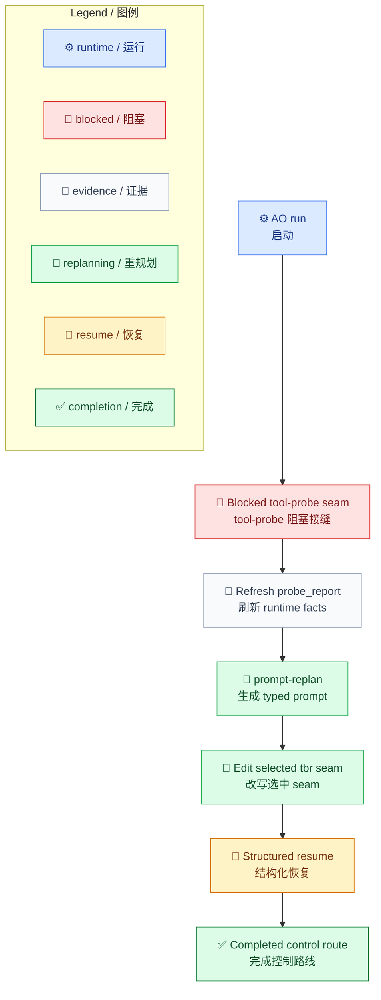

# AO Blocked Replan 运行

[English](../../en/examples/ao-blocked-replan-run.md) | [根目录](../README.md)

这个示例展示一个端到端 AO 路径：`run` 先从外部编写的 `WorkflowInstance` 起步，然后 blocked，调用方先刷新或确认 `probe_report` 与相关 `plan_meta` 事实，再通过 `prompt-replan` 向 AO 请求更丰富的 replanner prompt，然后改写选中的 seam。

## 场景

目标是一条 AO runtime 调查路线。AO 在 tool-probe seam 处 blocked，因为下一步需要先拿到扎实的 runtime facts，才能展开选中的 `tbr` seam。调用方会先刷新或确认 `probe_report` 与相关 `plan_meta` 事实，再向 AO 请求更丰富的 replanner prompt，然后改写选中的 seam。

## AO 路线 Mermaid / 解释性路线

这张图是解释性路线，不是 compile evidence，因为本示例没有嵌入 checked-in workflow JSON。正式 `run` 前，请使用选定的 AO runtime compile 调用方持有的 `workflow-instance.json`。



## 第 1 步：启动 AO 并接住 blocked 返回

先准备好外部编写的 `workflow-instance.json`，再从同一份图启动 AO：

```powershell
.\ao.exe run --workflow-file workflow-instance.json --context-file context.json --audit-output outputs\audit
```

预期返回形状：

```guide-example
name: ao-run-blocked-probe
ao-return:
  type: boundary
  status: blocked
  workflow_file: workflow-instance.json
  event_log_file: workflow-instance.json.events.jsonl
  workflow_instance_file: workflow-instance.json
  current_node_id: boundary.tool_probe
  boundary_reason: tool_probe_required
  pending_requirements:
    - probe_report
  next_frontier:
    - probe_repo_structure
    - probe_recent_logs
```

这次 blocked 返回意味着下一次 weave-back 必须保留稳定的 `probe_report` key。如果现有 runtime facts 已经过时，就应先刷新它们，再去请求 replanner prompt。

## 第 2 步：在 AO 外刷新 Runtime Facts

当 blocked seam 需要新的证据时，先在 AO 外收集并落地这些事实工件，且不要放在 skill 文件夹里。

```powershell
tool-probe.ps1 -OutputFile outputs\reports\probe-report.json
```

这些 runtime fact 工件重点可以长这样：

```guide-example
name: runtime-fact-artifacts
probe_report:
  status: fresh
  repo_summary: runtime pointers confirmed
  unresolved_surface:
    - selected_tbr replacement path still missing
plan_meta:
  selected_frontier_action: probe_repo_structure
  next_step_prompt: 把 probe facts 带过 seam 编辑与下一次 resume。
```

这些外部事实文件本身不会直接改写 AO 当前的 blocked snapshot。它们只有在调用方用于 seam 编辑，并在下一次 `resume` 中通过稳定 key weave back 时，才会成为这一轮 replan 的 AO 输入。

```guide-example
name: runtime-fact-reentry
generated_outside_ao:
  - outputs/reports/probe-report.json
consumed_during_replan:
  - prompt.replan.runtime-context
  - workflow-instance.json seam edit
woven_back_into_ao:
  - payload.probe_report
  - payload.plan_meta.selected_frontier_action
```

## 第 3 步：向 AO 请求 replanner prompt

直接使用返回的 `workflow_instance_file` 作为当前图形态 runtime surface，然后向 AO 请求 typed prompt payload。

```powershell
.\ao.exe prompt-replan --workflow-file workflow-instance.json --objective-file objective.md --tbr-id transition.main_tbr
```

预期 prompt payload 重点：

```guide-example
name: ao-prompt-replan-payload
ao-prompt:
  type: prompt
  command: prompt-replan
  prompt_kind: replan
  prompt_template_version: ao.workflow.prompt.v3
  blocks:
    - block_id: prompt.replan.runtime-context
      block_kind: guide-template
    - block_id: prompt.replan.blocked-boundary-context
      block_kind: guide-template
    - block_id: prompt.replan.selected-tbr-projection
      block_kind: guide-example
    - block_id: prompt.replan.current-workflow-projection
      block_kind: guide-example
    - block_id: prompt.replan.current-workflow-instance
      block_kind: guide-example
    - block_id: workflow.output-schema
      block_kind: guide-contract
```

这条流里，调用方应按稳定 `block_id` 消费 block，而不是按 prompt 行号或 prose 位置消费。这里通常会读取：

- `prompt.replan.runtime-context`
- `prompt.replan.blocked-boundary-context`
- `prompt.replan.selected-tbr-projection`
- `prompt.replan.current-workflow-projection`
- `prompt.replan.current-workflow-instance`
- `workflow.output-schema`
- `workflow.root-field-contract`

调用方还应同时读取 `probe-report.json`。AO 不会自动吸收任意外部文件；调用方必须在 seam 编辑和下一次 `resume` payload 里保留这些稳定字段名，才能把它们真正回灌进 AO。

## 第 4 步：改写 WorkflowInstance seam

调用方在 `workflow-instance.json` 中改写选中的 `tbr` seam，让替换路径重新接回原来的 predecessor 和 target，同时在图中别处保留至少一个剩余 `tbr`。

最小 before/after 思路：

```guide-example
name: selected-tbr-edit-intent
before:
  selected_tbr_id: transition.main_tbr
  predecessor_state_ids:
    - state.review
  target_node_id: state.end
after:
  replacement_path:
    - transition.route_from_probe_report
    - transition.inspect_runtime_pointer
    - transition.capture_followup_gap
  seam_design_notes:
    - 用 probe_report.repo_summary = runtime pointers confirmed 固定路线选择。
    - 在下一次 resume 中保留 payload.probe_report 与 payload.plan_meta.selected_frontier_action。
  preserved_remaining_tbr:
    - transition.remaining_tbr
```

## 第 5 步：带着结构化结果恢复 AO

调用方仍然通过公开控制载荷去 `resume` AO，而不是把修改后的 WorkflowInstance 当成新的 AO 顶层 schema 直接塞回去。

```json
{
  "transition_id": "transition.tool_probe",
  "correlation_key": "runtime-probe",
  "payload": {
    "probe_report": {
      "status": "fresh",
      "repo_summary": "runtime pointers confirmed",
      "unresolved_surface": [
        "selected_tbr replacement path still missing"
      ]
    },
    "plan_meta": {
      "selected_frontier_action": "probe_repo_structure",
      "next_step_prompt": "把 probe report 的 key 继续带过更新后的 seam 与下一次 resume。"
    }
  }
}
```

```powershell
.\ao.exe resume --workflow-file workflow-instance.json --result-file result-probe.json --audit-output outputs\audit
```

## 这个示例明确了什么

- 调用方管理的 runtime fact 工件只有在被用于 seam 编辑，并通过稳定 resume payload key weave back 时，才会成为 replan 输入。
- `prompt-replan` 会输出承载 runtime facts 的 `prompt.replan.runtime-context`。
- 调用方需要保留 `probe_report` 与 `payload.plan_meta.*` 这类稳定 key，而不是把这些决策压扁成 prose-only notes。
- `prompt-replan` 是 AO 自有的 support surface，会从代码里生成 typed prompt blocks。
- 调用方按 `block_id` 消费 prompt blocks，而不是靠模糊 prose 匹配。
- AO 正式运行面仍然是 Windows 的 direct `ao.exe run` / `ao.exe resume`，或 Unix 的 `ao run` / `ao resume`。
- `workflow_file` 是 snapshot 控制文件；`workflow_instance_file` 指向审计连续性与 replan 编辑所用的同一份当前外部图。
- WorkflowInstance 由调用方管理，并保存在 run/resume 链路使用的同一份外部 workflow file 中，且位于 skill 目录之外。
