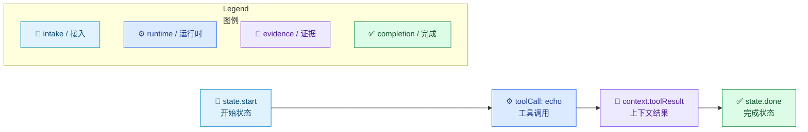
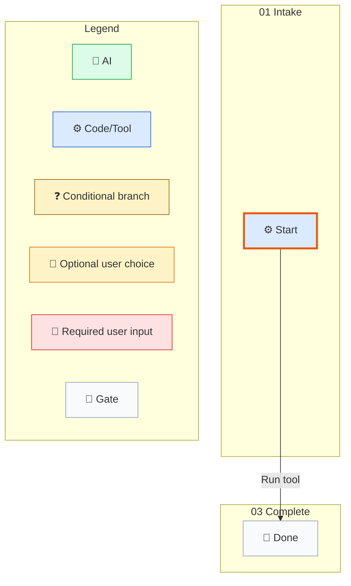

# 基础 Task Tracking 示例

[English](../../en/examples/basic-task-tracking.md) | [根目录](../README.md)

这个示例展示了最小但值得保留的公开 workflow 形状。

## 流程

1. 一个 workflow instance 从某个 state node 开始。
2. 一个确定性 transition 更新 context。
3. 一个 history entry 记录这次移动。
4. 命令输出会被捕获进 workflow context 和最终 result payload。

## 最小 Workflow File

```json
{
	"instanceId": "sample1",
	"nodes": {
		"state.start": {
			"$kind": "state",
			"id": "state.start",
			"name": "Start",
			"workflowPhase": "01 Intake",
			"groups": [
				{
					"id": "group.main",
					"strategy": "firstSuccess",
					"transitionIds": ["transition.run"]
				}
			],
			"waitBehavior": "blockUntilComplete"
		},
		"state.done": {
			"$kind": "state",
			"id": "state.done",
			"name": "Done",
			"workflowPhase": "03 Complete",
			"groups": [],
			"waitBehavior": "blockUntilComplete"
		},
		"transition.run": {
			"$kind": "command",
			"id": "transition.run",
			"name": "Run tool",
			"targetNodeId": "state.done",
			"outputPath": "toolResult",
			"stepKind": "toolCall",
			"guardExpression": "true",
			"succeedExpression": "true",
			"command": {
				"kind": "tool",
				"name": "echo",
				"parameters": {
					"message": "hello"
				},
				"currentRetryCount": 0
			},
			"currentRetryCount": 0,
			"maxRetry": 10
		}
	},
	"startNodeId": "state.start",
	"currentNodeId": "state.start",
	"endNodeId": "state.done",
	"status": "readyToStart",
	"context": {},
	"history": [],
	"version": 0,
	"activeWaitGroups": []
}
```

## 运行命令

```powershell
.\so.exe run --workflow-file .\workflow.json
```

## 预期结果

- SO 会执行确定性的 `toolCall` 步骤。
- workflow 会在 `state.done` 结束。
- 最终 `<so_property>` 块会携带一个 `result` payload。


## 执行图



## Compile 证据

这个 workflow JSON 示例面向 SO runtime。请把它放到 skill 目录之外的 external workflow copy，再用同版本 runtime 执行下面的命令；返回的 Mermaid 和 audit 文件必须留在临时输出根目录。checked-in 示例是解释层 source，实际运行 copy 生成的 Mermaid 才是执行 authority。

```powershell
.\so.exe compile --workflow-file <external-workflow.json> --audit-output <external-audit-root>
```


## Runtime 生成的 Mermaid（SO 0.3.316-beta）

来源 workflow：`basic-task-tracking.md` 的第一个 JSON workflow block。命令：`so.exe compile --workflow-file <external-workflow.json> --audit-output <external-audit-root>`。


