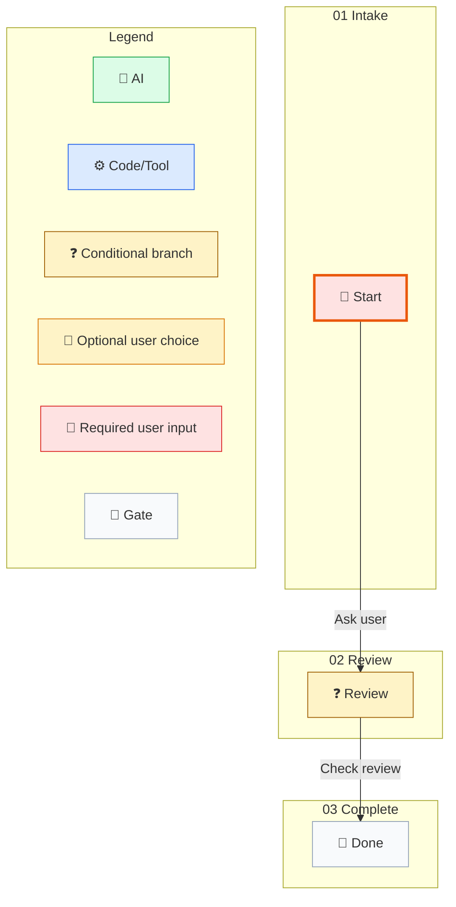

# Skill 驱动 Workflow 示例

[English](../../en/examples/skill-driven-workflow.md) | [根目录](../README.md)

这个示例说明 SO 如何拥有确定性执行，而调用方如何拥有通过 boundary payload 暴露出来的外部 seam。

## 流程

1. 调用方提供 workflow 输入。
2. SO 运行到外部 seam。
3. SO 返回一个 boundary payload，用当前 step kind 和 required inputs 把这个 seam 暴露出来。
4. 调用方执行外部动作，并送回结构化的 resume envelope。
5. SO 用恢复后的 context 做判断，并确定性地结束在 done state。

## 可恢复的 Workflow File

```json
{
  "instanceId": "ask1",
  "nodes": {
    "state.start": {
      "$kind": "state",
      "id": "state.start",
      "name": "Start",
      "workflowPhase": "01 Intake",
      "groups": [
        {
          "id": "group.ask",
          "strategy": "firstSuccess",
          "transitionIds": ["transition.ask"]
        }
      ],
      "waitBehavior": "blockUntilComplete"
    },
    "state.review": {
      "$kind": "state",
      "id": "state.review",
      "name": "Review",
      "workflowPhase": "02 Review",
      "groups": [
        {
          "id": "group.review",
          "strategy": "firstSuccess",
          "transitionIds": ["transition.check"]
        }
      ],
      "waitBehavior": "blockUntilComplete"
    },
    "state.done": {
      "$kind": "state",
      "id": "state.done",
      "name": "Done",
      "workflowPhase": "03 Complete",
      "groups": [],
      "waitBehavior": "blockUntilComplete"
    },
    "transition.ask": {
      "$kind": "command",
      "id": "transition.ask",
      "name": "Ask user",
      "description": "Need structured result",
      "targetNodeId": "state.review",
      "stepKind": "askUser",
      "command": {
        "kind": "tool",
        "name": "noop",
        "environmentKey": "",
        "parameters": {
          "requiredInputs": ["filePath", "content"]
        },
        "currentRetryCount": 0
      },
      "currentRetryCount": 0,
      "maxRetry": 10
    },
    "transition.check": {
      "$kind": "expr",
      "id": "transition.check",
      "name": "Check review",
      "targetNodeId": "state.done",
      "stepKind": "conditionBranch",
      "guardExpression": "true",
      "succeedExpression": "review.approved == true",
      "currentRetryCount": 0,
      "maxRetry": 10
    }
  },
  "startNodeId": "state.start",
  "currentNodeId": "state.start",
  "endNodeId": "state.done",
  "status": "readyToStart",
  "context": {},
  "history": [],
  "version": 0,
  "activeWaitGroups": []
}
```

## 第一次运行

```powershell
dotnet so.dll run --workflow-file .\ask-workflow.json
```

预期控制载荷摘录：

```xml
<so_property>
{"type":"boundary","payload":{"status":"blocked","current_step_kind":"AskUser","required_inputs":["filePath","content"]}}
</so_property>
```

## Resume Envelope

```json
{
  "transition_id": "transition.ask",
  "correlation_key": null,
  "payload": {
    "review": {
      "approved": true
    }
  }
}
```

## Resume 命令

```powershell
dotnet so.dll resume --workflow-file .\ask-workflow.json --result-file .\resume.json
```

预期最终控制载荷摘录：

```xml
<so_property>
{"type":"result","payload":{"status":"completed","current_node_id":"state.done"}}
</so_property>
```

## 如何理解这个结果

- `run` 和 `resume` 之间的外部动作由调用方拥有。
- seam 前后的持久化 workflow state 由 SO 拥有。
- 结构化 resume envelope 是公开契约的一部分，不是内部细节。

## 路线图

```mermaid
flowchart LR
    A["🧭 Input<br/>输入"] --> B["⚙️ SO run<br/>SO 运行"]
    B --> C{"❓ External seam?<br/>是否到达外部 seam?"}
    C -- "No<br/>否" --> D["✅ state.done<br/>完成"]
    C -- "Yes<br/>是" --> E["🚧 Boundary payload<br/>边界载荷"]
    E --> F["🔁 Structured resume<br/>结构化恢复"]
    F --> G["💬 Review resumed context<br/>检查恢复后的 context"]
    G --> D

    classDef intake fill:#e0f2fe,stroke:#0284c7,color:#0c4a6e;
    classDef runtime fill:#dbeafe,stroke:#2563eb,color:#1e3a8a;
    classDef decision fill:#fef3c7,stroke:#a16207,color:#713f12;
    classDef blocked fill:#fee2e2,stroke:#dc2626,color:#7f1d1d;
    classDef review fill:#ffedd5,stroke:#ea580c,color:#9a3412;
    classDef done fill:#dcfce7,stroke:#15803d,color:#14532d;
    class A intake;
    class B,F runtime;
    class C decision;
    class E blocked;
    class G review;
    class D done;
    subgraph legend["Legend<br/>图例"]
        L1["🧭 intake / 接入"]
        L2["⚙️ runtime / 运行时"]
        L3["❓ decision / 决策"]
        L4["🚧 blocked / 阻塞"]
        L5["🔁 resume / 恢复"]
        L6["✅ completion / 完成"]
    end
    class L1 intake;
    class L2 runtime;
    class L3 decision;
    class L4 blocked;
    class L5 runtime;
    class L6 done;
```



## Compile 证据

这个 JSON 是公开契约示例。在把 Mermaid 当成执行证据前，应使用精确 SO runtime 编译一份 external copy：

```powershell
dotnet so.dll compile --workflow-file <external-workflow.json> --audit-output <external-audit-root>
```


## Runtime 生成的 Mermaid（SO 0.3.316-beta）

来源 workflow：`skill-driven-workflow.md` 的第一个 JSON workflow block。命令：`so.exe compile --workflow-file <external-workflow.json> --audit-output <external-audit-root>`。


