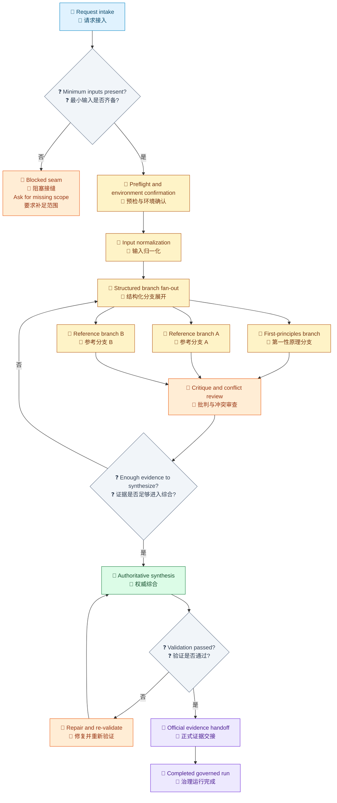
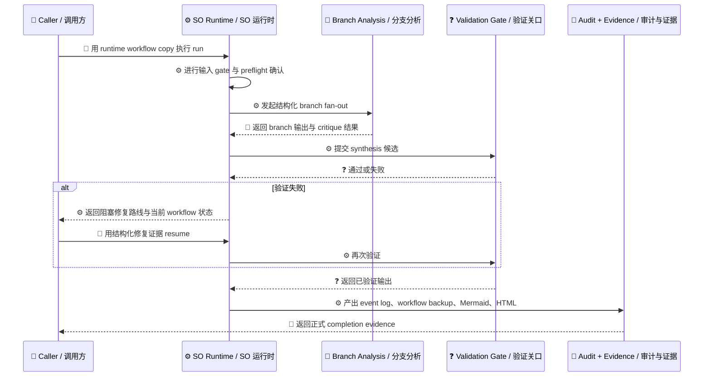

# Loom 治理 Skill 运行示例

[English](../../en/examples/so-enhanced-skill-run.md) | [根目录](../README.md)

这个示例展示的是一个通用化的 Loom 治理 target skill 运行过程。它的重点不是某个技术领域本身，而是 Loom Skill Orchestrator governance 如何把一条复杂运行路线从输入到完成都保持在正确轨道上。

> [!NOTE]
> 本页刻意隐藏产品领域细节、厂商细节、仓库私有锚点与本地文件名。重点是说明：当任务足够大、足够容易漂移时，SO 如何用治理路线把运行保持正确。

## 建议配套阅读

- [SkillOrchestrator Guide](../guides/so-guide.md)
- [Skills 参考](../reference/skills.md)
- [Workflow 术语](../../en/architecture/workflow-terminology.md)
- [Skill 驱动 Workflow 示例](skill-driven-workflow.md)

## 场景速览

这个运行从一个常见工程请求开始，并且必须收束成一份 implementation-ready 的输出包，同时保留可追踪、可复核、可恢复、可审计的特性。

如果没有治理，这类运行通常会沿着四种路径漂移：

- scope 接收得过于宽松
- branch 探索深浅不一
- 证据不足就提前开始 synthesis
- 文档看起来完成了，但没有正式审计闭环

Loom Skill Orchestrator governance 的作用就是在这些漂移发生之前，把运行重新压回一条显式路线。

## 路线图

图例：`🧭` intake / 接入，`🚧` blocked or repair / 阻塞或修复状态，`🔎` branch analysis / 分支分析，`📝` synthesis / 综合，`🧾` evidence handoff / 证据交接，`❓` decision gate / 决策关口。

## 为什么路线能保持正确

图例：`👤` caller action / 调用动作，`⚙️` runtime action / 运行时动作，`🔎` branch analysis / 分支分析，`❓` validation gate / 验证关口，`🧾` audit evidence / 审计证据。

## 分阶段叙述

### 1. 输入 gating

SO 会先停住运行，直到最小输入被确认。这一步很早就完成了三件事：

- 把模糊 scope 变成显式约束
- 把缺失假设变成真实默认值或真实决定
- 在重分析开始前先稳定请求上下文

### 2. Preflight 与环境确认

SO 要求在主路线继续前先确认环境与执行上下文。这不仅是工具可用性检查，更是路线保护，避免在未验证基础上开始大段分析。

### 3. 输入归一化

上游原始材料先被转换成适合下游消费的标准化工件。这样后面的 branch、批判、synthesis 都能围绕同一套 canonical inputs，而不是混杂原始碎片继续推进。

### 4. 结构化 branch fan-out

运行不会只走一条线性设计路线，而是明确拆成第一性原理分支、多个 reference-style 分支，以及每个分支的 critique。SO 让这些 branch 以可比较的结构落地后，才允许后续继续。

### 5. 先 critique 再 synthesis

SO 不允许把 branch 生成误当成最终设计。每个 branch 都必须先经过批判，弱假设和冲突点会先暴露，再决定是否进入 synthesis。

### 6. 权威 synthesis

只有 branch evidence 与 critique 已经齐备时，SO 才允许进入 synthesis。这使最终输出不再是“第一个看起来可行的答案”，而是来自前序证据的显式归纳。

### 7. 验证关口

验证是硬 gate，不是礼貌步骤。只要权威输出还没通过结构与完整性要求，运行就不能宣布完成。

### 8. 正式 evidence handoff

真正的完成不是一句 “done”。SO 要求运行以正式证据集收尾，这样后续任何人都能在不依赖聊天记忆的前提下重建这条路线。

## SO 实际产出了什么

| 表面 | 贡献了什么 | 为什么重要 |
| --- | --- | --- |
| Workflow state | 持久化、阶段感知的控制路径 | 防止静默漂移 |
| Event log | 按 step 记录的执行历史 | 让运行可审计 |
| Mermaid + HTML renders | 某一时刻的 workflow 可视化 | 让进度和恢复更容易解释 |
| Workflow analysis JSON | 输入、输出、分支、循环、seam、gate 与控制风险摘要 | 让路线在执行前可审阅 |
| Blocked seams | 带 resume 要求的结构化暂停 | 让恢复保持确定性 |
| Completion evidence | 正式 done-state handoff | 把“看起来完成”与“官方完成”区分开 |

## Evidence 形状

一个成功的治理运行最终会留下这样一组小而关键的证据：

- 当前 workflow state 或终态 workflow state
- 追加式 event log
- 某一时刻的 Mermaid Markdown 与 HTML render
- 每个审计 step 的 workflow JSON backup
- 每个审计 step 的 workflow analysis JSON
- 与权威输出绑定的 validation pass 信号

正因为有这组证据，结果才不仅是“完成”，而且还是可复核、可恢复、可追责的。

## 为什么这个模式可复用

只要一个 skill 需要做到下面这些事，这条路线就值得复用：

- 把模糊输入转成结构化输出包
- 在选择前比较多条设计路径
- 保存 critique 和 conflict resolution
- 在 closure 之前验证主要输出
- 以可审计 completion evidence 结束运行

真正可复用的资产不是某个领域里的内容，而是这条被治理过的执行形状。

## 推荐定位方式

请把这个示例定位为：

- workflow governance 示例
- traceability 示例
- structured synthesis 示例
- completion discipline 示例

不要把它定位成某个领域的设计参考，否则就会重新引入本页刻意隐藏掉的技术细节。

## 关键结论

- SO 最重要的价值，是控制路线质量，而不只是帮你更快地产出内容。
- 运行之所以保持正确，是因为每一步进展都必须先通过 gate。
- branching、critique、synthesis、validation、evidence closure 属于同一条官方路径。
- 被治理过的运行更强，正是因为它不能绕过结构。

## 继续阅读

- 返回 [示例目录](README.md)
- 阅读运行时契约：[SkillOrchestrator Guide](../guides/so-guide.md)
- 阅读 skill 层规则：[Skills 参考](../reference/skills.md)
