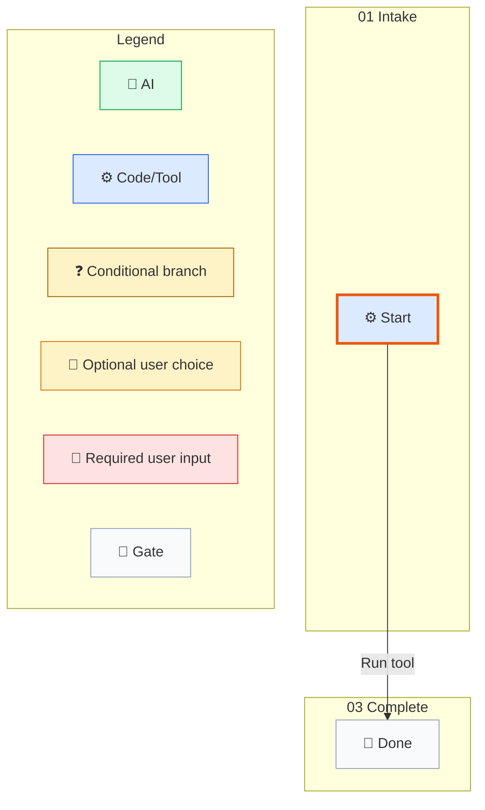
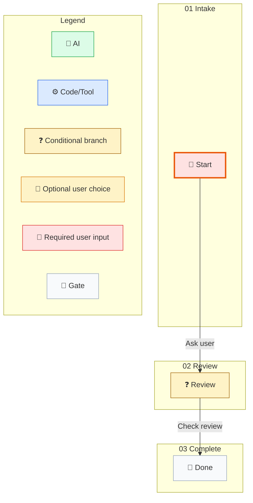

# 第一个 Workflow

[English](../../en/getting-started/first-workflow.md) | [根目录](../README.md)

最短且有意义的第一个 workflow，建议从 SO 拥有的确定性流程开始。

## 路径 1：最快可运行路径

先用内建 shorthand：

```powershell
.\so.exe ls .
```

它会做的事：

1. 把 shorthand 编译成 workflow。
2. 跑一个 wrapped command-line 目录列举。
3. 把完成后的 workflow state 写回一个临时 workflow file。
4. 输出最终的 `<so_property>` 结果块。

## 路径 2：手写 Workflow File

当你想直接看到当前公开 workflow 契约时，用这条路径。

最小 workflow file：

```json
{
  "instanceId": "sample1",
  "nodes": {
    "state.start": {
      "$kind": "state",
      "id": "state.start",
      "name": "Start",
      "workflowPhase": "01 Intake",
      "groups": [
        {
          "id": "group.main",
          "strategy": "firstSuccess",
          "transitionIds": ["transition.run"]
        }
      ],
      "waitBehavior": "blockUntilComplete"
    },
    "state.done": {
      "$kind": "state",
      "id": "state.done",
      "name": "Done",
      "workflowPhase": "03 Complete",
      "groups": [],
      "waitBehavior": "blockUntilComplete"
    },
    "transition.run": {
      "$kind": "command",
      "id": "transition.run",
      "name": "Run tool",
      "targetNodeId": "state.done",
      "outputPath": "toolResult",
      "stepKind": "toolCall",
      "guardExpression": "true",
      "succeedExpression": "true",
      "command": {
        "kind": "tool",
        "name": "echo",
        "parameters": {
          "message": "hello"
        },
        "currentRetryCount": 0
      },
      "currentRetryCount": 0,
      "maxRetry": 10
    }
  },
  "startNodeId": "state.start",
  "currentNodeId": "state.start",
  "endNodeId": "state.done",
  "status": "readyToStart",
  "context": {},
  "history": [],
  "version": 0,
  "activeWaitGroups": []
}
```

运行命令：

```powershell
.\so.exe run --workflow-file .\workflow.json
```

## Runtime 生成的 Mermaid（SO 0.3.316-beta）

来源：路径 2 的第一个 JSON workflow block。命令：`so.exe compile --workflow-file <external-workflow.json> --audit-output <external-audit-root>`。

Mermaid artifact: `<external-audit-root>/first-audit-zh-1-v1/wf-sample1/step-0001-compiled/workflow.mermaid.md`; HTML: `<external-audit-root>/first-audit-zh-1-v1/wf-sample1/step-0001-compiled/workflow.html`; compile feedback: `<external-audit-root>/first-audit-zh-1-v1/wf-sample1/step-0001-compiled/workflow.compile-feedback.json`.




## 路径 3：先 Weave Out，再 Resume

一个会在显式 seam 处 weave out，并通过 blocked payload 暴露出来的可恢复 workflow 示例：

```json
{
  "instanceId": "ask1",
  "nodes": {
    "state.start": {
      "$kind": "state",
      "id": "state.start",
      "name": "Start",
      "workflowPhase": "01 Intake",
      "groups": [
        {
          "id": "group.ask",
          "strategy": "firstSuccess",
          "transitionIds": ["transition.ask"]
        }
      ],
      "waitBehavior": "blockUntilComplete"
    },
    "state.review": {
      "$kind": "state",
      "id": "state.review",
      "name": "Review",
      "workflowPhase": "02 Review",
      "groups": [
        {
          "id": "group.review",
          "strategy": "firstSuccess",
          "transitionIds": ["transition.check"]
        }
      ],
      "waitBehavior": "blockUntilComplete"
    },
    "state.done": {
      "$kind": "state",
      "id": "state.done",
      "name": "Done",
      "workflowPhase": "03 Complete",
      "groups": [],
      "waitBehavior": "blockUntilComplete"
    },
    "transition.ask": {
      "$kind": "command",
      "id": "transition.ask",
      "name": "Ask user",
      "description": "Need structured result",
      "targetNodeId": "state.review",
      "stepKind": "askUser",
      "command": {
        "kind": "tool",
        "name": "noop",
        "environmentKey": "",
        "parameters": {
          "requiredInputs": ["filePath", "content"]
        },
        "currentRetryCount": 0
      },
      "currentRetryCount": 0,
      "maxRetry": 10
    },
    "transition.check": {
      "$kind": "expr",
      "id": "transition.check",
      "name": "Check review",
      "targetNodeId": "state.done",
      "stepKind": "conditionBranch",
      "guardExpression": "true",
      "succeedExpression": "review.approved == true",
      "currentRetryCount": 0,
      "maxRetry": 10
    }
  },
  "startNodeId": "state.start",
  "currentNodeId": "state.start",
  "endNodeId": "state.done",
  "status": "readyToStart",
  "context": {},
  "history": [],
  "version": 0,
  "activeWaitGroups": []
}
```

## Runtime 生成的 Mermaid（SO 0.3.316-beta）

来源：路径 3 workflow JSON block。命令：`so.exe compile --workflow-file <external-workflow.json> --audit-output <external-audit-root>`。

Mermaid artifact: `<external-audit-root>/first-audit-zh-2-v1/wf-ask1/step-0001-compiled/workflow.mermaid.md`; HTML: `<external-audit-root>/first-audit-zh-2-v1/wf-ask1/step-0001-compiled/workflow.html`; compile feedback: `<external-audit-root>/first-audit-zh-2-v1/wf-ask1/step-0001-compiled/workflow.compile-feedback.json`.




第一次运行：

```powershell
.\so.exe run --workflow-file .\ask-workflow.json
```

第一次运行预期 SO property 形状：

```xml
<so_property>
{"type":"boundary","payload":{"status":"blocked","current_step_kind":"AskUser","required_inputs":["filePath","content"]}}
</so_property>
```

Resume sidecar：

```json
{
  "transition_id": "transition.ask",
  "correlation_key": null,
  "payload": {
    "review": {
      "approved": true
    }
  }
}
```

Resume 命令：

```powershell
.\so.exe resume --workflow-file .\ask-workflow.json --result-file .\resume.json
```

Resume 之后预期 SO property 形状：

```xml
<so_property>
{"type":"result","payload":{"status":"completed","current_node_id":"state.done"}}
</so_property>
```

## 为什么这三条路径重要

1. 先把简写请求编译成 workflow，或直接写一个小型 workflow JSON。
2. 运行 SO，直到 blocked 或 finished。
3. 如果 SO 阻塞，就执行它要求的外部步骤，再用结构化结果 envelope 恢复。

## 最低方向

- 从一个本地确定性工具步骤开始。
- 增加一个显式状态更新。
- 先以一个被捕获的 result payload 结束。只有 workflow 真的需要独立产物步骤时，才额外引入 `ArtifactEmit`。

示例章节会给出同一路径的叙述版示例。
