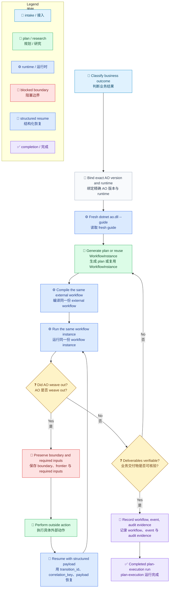

# Loom Agent Plan-Execution Orchestrator Flow

[English](../../en/guides/ao-guide-flow.md) | [Hub](ao-guide.md) | [Reference](ao-guide-reference.md) | [根目录](../README.md)

<!-- guide-version:start -->
版本：0.3.318
构建：已发布的 0.3.318 包
<!-- guide-version:end -->


## 用途

这页只保留 Loom Agent Plan-Execution Orchestrator 的最短操作路径。固定的 `ao-guide.md` 是 guide hub；完整契约、示例或反模式请阅读 [AO Guide 完整参考](ao-guide-reference.md)。

## 流程

AO 是处理不确定性的 plan-execution 路线。它保持同一份 external workflow instance，让调用方完成计划、探查、weave out 和 weave back。

图例：`🧭` 接入，`📜` 契约，`🔎` 规划/研究，`⚙️` 运行时，`🚧` 阻塞边界，`🔁` 恢复，`🧾` 证据，`✅` 完成，`❓` 决策。



## Runtime 检查

- framework-dependent 模式只能使用 resolver 生成的 bundle，其中包含 `ao.dll`、生成的 `ao.deps.json`、`ao.runtimeconfig.json`、平铺依赖文件和精确 package closure；raw product `.nupkg` 或 `lib/net9.0` extraction 不是可运行 bundle，必须通过 `dotnet exec --depsfile ... --runtimeconfig ... ao.dll` 启动。
- self-contained 模式只能使用精确 RID runtime package 及其 native entry point。
- 从 `--guide` 到 `compile`、`run`、`resume`，始终保持同一 launch descriptor、版本和 RID。
- workflow 自有 schema 和控制元数据使用英文。
- 用户和业务 payload 可以保留来源语言。
- runtime state、event log 和 audit output 保持在 skill 目录之外。

## CLI 速查

```powershell
dotnet ao.dll --guide
dotnet ao.dll compile --workflow-file <external-workflow.json> --audit-output <external-audit-root>
dotnet ao.dll run --objective-file <objective.md> --session-dir <session-dir> --instance-file <external-workflow.json> --audit-output <external-audit-root>
dotnet ao.dll resume --session-dir <session-dir> --session-id <id> --result-file <result.json>
```

`--guide`、`compile`、`prompt-plan` 和 `prompt-replan` 用于准备或恢复；只有 `run` 与 `resume` 是 AO 的正式 skill run。

## Blocked 返回

读取结构化 blocked payload，保留 `session_id`、`workflow_file`、`workflow_instance_file`、`event_log_file`、`current_node_id` 和最新 transition 数据。第一次创建图时使用 `prompt-plan`；只有后续 frontier 或 `tbr` 路径需要重设计时才使用 `prompt-replan`。恢复时传入 `transition_id`、可选的 `correlation_key` 和结构化 `payload`。

## 继续阅读

- [AO Guide Hub](ao-guide.md)
- [AO Guide 完整参考](ao-guide-reference.md)
- [Workflow Schema](../reference/workflow-schema.md)
- [Workflow 术语](../../en/architecture/workflow-terminology.md)
