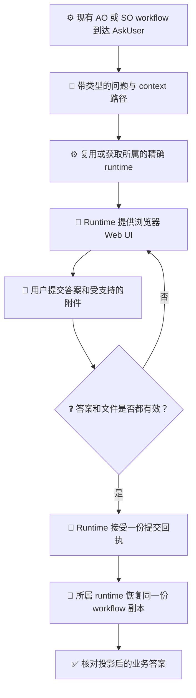

# 结构化 AskUser 指南

[English](../../en/guides/ask-user-guide.md) | [指南索引](README.md) | [设计](../architecture/ask-user-design.md)

<!-- guide-version:start -->
版本：runtime-neutral
构建：面向 Loom AskUser Web UI 的 runtime-neutral 指南
兼容性：适用于所属 AO/SO runtime 中现有的 typed AskUser wait；具体能力取决于精确发布版本。
<!-- guide-version:end -->

## 选择合适的入口

- **跨 agent 默认优先级：** 收集属于业务 workflow 的需求、决定、约束或其他用户输入时，优先使用 `/loom-ask-user`，而不是 agent 自带的 AskUser/提问界面；用户不必明确提出要浏览器表单。
- **一次提交：** 把目前已知且相互独立的问题放进同一份有序表单，一次提交收齐。只有后续问题确实依赖这些答案时，才再追问。
- 复用现有 AO/SO workflow 的 `AskUser` wait；如果该业务 workflow 正在设计或更新，就把 wait 放进同一份 workflow。不要另建只用于提问的 workflow。
- 只有即时澄清不属于 workflow、没有合适业务 workflow 可承载 `AskUser` wait、用户明确选择内置界面，或精确发布 runtime 缺少所需表单能力时，才使用 agent 内置对话提问界面。内置工具是回退方案，不应因 agent 不同而有不同默认入口。
- 当前没有独立的 `so ask` 或 `ao ask` 命令。

`/loom-ask-user` 是一个轻量 Agent Skill，主要用途是使用 Loom runtime 提供的 Web UI。它没有自己的 workflow template、SO governance 或 package lock。Skill 文件夹位于 `.agents/skills/loom-ask-user/`，与 NuGet runtime `.nupkg` 分开。Web UI 必须使用拥有现有 workflow 的、精确且支持 AskUser 的 AO 或 SO runtime；skill 会复用标准缓存，或获取该精确依赖。详见 [runtime 依赖规则](../../../.agents/skills/loom-ask-user/reference/runtime-dependency.md)。

## Runtime 提供的 Web UI

下图用于解释流程。现有业务 workflow 拥有 `AskUser` 和 `WaitResume`；由其 runtime 生成并提供表单。该 skill 不会另建或治理 workflow。

图例：⚙️ runtime/workflow 所有者（蓝）；📜 问题契约（靛蓝）；💬 浏览器交互（琥珀）；🧾 已提交数据（紫）；❓ 校验决策（红）；🔁 继续执行（青绿）；✅ 已核对结果（绿）。标签和符号都表达含义，不只依赖颜色。

## 按语义设计问题

使用有序问题组和稳定的问题 ID。每个带类型的问题都应说明 context、intent、prompt、context 路径绑定、必填状态及适用的约束。`requiredInputs` 仍是 context 路径。SO workflow 中每个 user-owned 答案路径也必须出现在 `validation.declaredUserOwnedFields` 中。

| 类型 | 自由文本的含义 |
| --- | --- |
| 文本 | 使用原有文本框；不要再加一个重复的 fallback 字段。 |
| 单选 | `Other` 是互斥的一个选项，并替代已声明选项。 |
| 多选 | `Other` 计作一个选择，并遵守选择数量上下限。 |
| 数字或布尔 | 有原生值时，文字用于补充说明；没有原生值时，非空文字就是答案。 |
| 文件或音频 | 文字可以补充附件；没有附件时，非空文字就是答案。 |

默认值只预填控件，不会满足必填条件。必填问题不能跳过。浏览器提交以 Common 服务端校验器为准。

## 运行现有 Workflow

对拥有 AskUser wait 的 AO/SO 业务 workflow 使用此流程。如果该 workflow 正在设计或更新，就把问题收集放进同一份 workflow；不要另建只负责提问的 workflow。该 skill 不会单独执行另一份 workflow。

1. 如果标准缓存中已有经过验证的精确、支持 AskUser 的 package，则复用它；否则按检测出的 RID 获取该精确发布版本。先读取 fresh `--guide` 结果。
2. 通过所属 runtime 在同一份 external workflow 副本上执行。到达 `AskUser` wait 后，runtime 提供表单，发起 agent 只在自己的嵌入式浏览器中使用 host 批准的路由。
3. 配对凭据不能出现在普通日志或进度消息中。不要猜测公网路由，也不要自动创建 tunnel。
4. 出现一份有效回执后，由所属 runtime 校验，并对同一份 workflow 副本执行现有 resume。worker 不得锁定、修改或恢复 `WorkflowInstance`。
5. 核对 workflow context 中投影后的最终答案。草稿已保存不等于答案已提交。

文件和音频使用受支持的附件路径与配置限制。不要获取任意 URL。如果页面提供 JSON 答案模式，可用它查看或下载当前答案；它不能替代服务端校验。

## 相关页面

- [AskUser 设计](../architecture/ask-user-design.md)
- [AskUser 实施计划](../architecture/ask-user-implementation-plan.md)
- [使用 Techne Loom Skills](skill-usage.md)
- [SkillOrchestrator 指南](so-guide.md)
- [Loom Agent Plan-Execution Orchestrator 指南](ao-guide.md)
