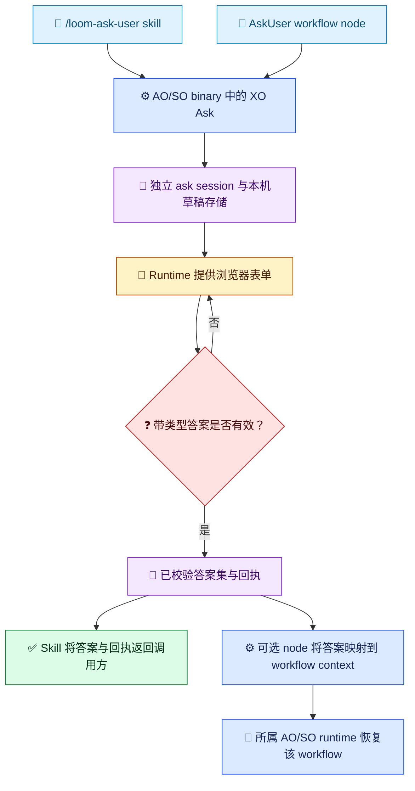

# XO Ask 与 AskUser 消费方

[English](../../en/guides/ask-user-guide.md) | [指南索引](README.md) | [设计](../architecture/ask-user-design.md)

<!-- guide-version:start -->
版本：0.3.335-beta
构建：已发布的 0.3.335-beta 包
<!-- guide-version:end -->

## 三层关系

`XO Ask` 是对现有 AO 或 SO runtime binary 所提供共享 ask 能力的简称；它不是第三个产品，也不是新的 package 家族。

| 层 | 职责 | 是否需要 workflow？ |
| --- | --- | --- |
| AO/SO binary 中的 XO Ask | 共享问题契约、浏览器会话、答案校验、本机草稿和回执 | 不需要 |
| `/loom-ask-user` skill | 面向 agent 的并列消费者：整理调用方问题、启动 ask session，并返回带类型答案和回执 | 不需要 |
| `AskUser` workflow node | 面向 workflow 的并列消费者：声明问题、把回执映射到 workflow context，并由所属 runtime 恢复执行 | 仅这个适配路径需要 |

Skill 和 node 是 XO Ask 的两个独立消费者，彼此不调用、不依赖。Standalone ask 有自己的 ask-session 身份和本机状态，不创建也不要求 `WorkflowInstance`。`contextPath`、`requiredInputs`、SO 的 `validation.declaredUserOwnedFields`、答案投影和 resume 都只属于 node 适配器。

## 当前发布状态

已发布的 `0.3.334-beta` package set **尚未**提供 standalone `ask` 命令。已核验的 SO apphost help 中没有该入口；同一 runtime 源代码版本线的 AO apphost 也没有 standalone 入口。该版本可以提供 workflow-owned AskUser Web UI，但这不意味着 skill 在设计上依赖 workflow，也不能据此声称 standalone 已支持。只有在某个已发布 AO 或 SO apphost 明确提供独立 ask 命令后，才能宣称 `/loom-ask-user` 的 workflow-free 路径可用。不要悄悄创建 workflow node，也不要默认退回 agent 内置提问工具来掩盖缺失的二进制能力。

## 预期的独立入口

1. 将调用方彼此独立的问题整理成有序、带类型的表单契约，保留 prompt、context、intent、必填状态、选项、自由填写和适用约束。
2. 从 skill 版本块解析 AO/SO release-set 的精确版本并检测 host RID。优先复用 standard cache 中经过验证的同版本 package；如果 AO 和 SO 都没有缓存，优先获取精确版本的 AO package。
3. 校验 package 身份、版本、RID、哈希、manifest、archive 路径、apphost 和 fresh guide，并确认所选 apphost 确实提供 standalone ask 入口。
4. 先将完整契约写入磁盘文件，再调用 `ao ask start --contract-file <path>` 或 `so ask start --contract-file <path>`。只呈现返回的 host 批准浏览器路由；不要推断公网 URL，也不要创建 tunnel。
5. 用户一次提交后，使用对应的 `ao ask result --ask-id <id>` 或 `so ask result --ask-id <id>` 查询结果。将带类型答案与回执返回调用方；skill 不恢复 workflow。

以上步骤描述目标契约；已发布的 `.334-beta` package 尚不可执行这条路径，因为已核验的 CLI 没有 standalone `ask` 入口。

## 共享浏览器流程

下图中的两个分支是同一二进制能力的独立消费者。每次调用只选择其中一个；skill 不经过 workflow node。

图例：🧭 消费方（蓝）；⚙️ binary 或 workflow-node 操作（蓝）；💬 用户交互（琥珀）；🧾 ask 状态/结果（紫）；❓ 校验决策（红）；🔁 可选 workflow 继续执行（青绿）；✅ 直接返回结果（绿）。标签和符号都表达含义，不只依赖颜色。

## 问题与答案语义

使用稳定问题 ID 和有序问题组。支持 `singleChoice`、`multipleChoice`、`text`、`number`、`boolean`、`file` 和 `audio`。默认值只预填控件，不会满足必填条件。选择题以 `Other` 提供自由文本替代项，因此澄清题既能给出推荐选项，也能保留用户自定义答案。详见[答案语义](../../../.agents/skills/loom-ask-user/reference/answer-semantics.md)。

Standalone 答案按问题 ID 返回，不需要 workflow context 路径。只有 `AskUser` node 作为消费者时，才由其适配器提供 `contextPath` binding、检查 `requiredInputs` 与 SO ownership 声明，再映射回执并调用所属 runtime 的现有 resume。这个 node 专属契约不约束 skill 消费方。

## Runtime 与安全

AO 和 SO 是彼此独立的产品，但共同发布同版本 runtime package 闭包。`XO Ask` 只是该共享能力的简称。Skill 版本块记录 release-set 精确版本，不表示指定版本一定已实现 standalone `ask`。

Pairing URL 是秘密，只能经批准的浏览器交接传递；不得写入普通进度消息、日志或审计摘要。只使用 host 批准的路由，不获取任意远程附件 URL。

## 相关页面

- [AskUser 设计](../architecture/ask-user-design.md)
- [AskUser 实施计划](../architecture/ask-user-implementation-plan.md)
- [使用 Techne Loom Skills](skill-usage.md)
- [SkillOrchestrator 指南](so-guide.md)
- [Loom Agent Plan-Execution Orchestrator 指南](ao-guide.md)
