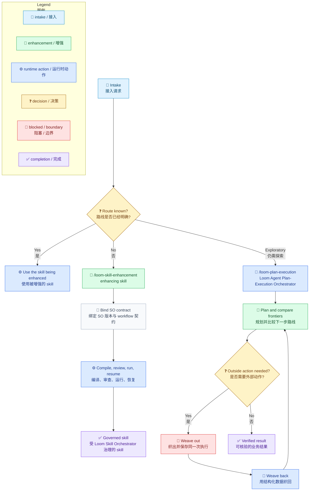
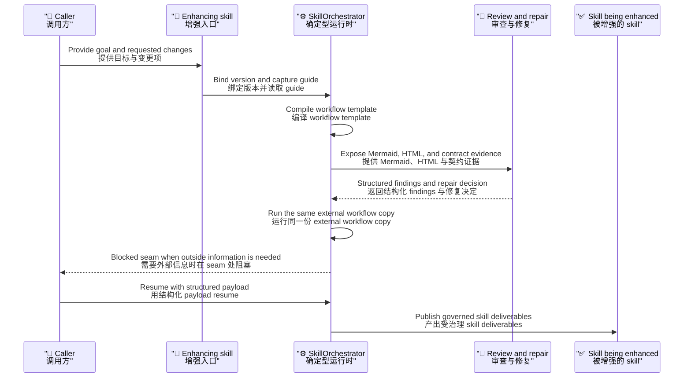

# 使用 Techne Loom Skills

[English](../../en/guides/skill-usage.md) | [根目录](../README.md)

这是一份面向操作者的 Techne Loom skill 使用入口文档。

## 先选对 Skill

按不确定性和风险选择入口。`/loom-skill-enhancement` 是 **enhancing skill**，负责把确定型需求变成受 Loom Skill Orchestrator 治理的 skill。`/loom-plan-execution` 在路线仍然探索时使用 **Loom Agent Plan-Execution Orchestrator**。

| 需求 | 从这里开始 |
| --- | --- |
| 把简短指令交给已有宿主使用 | Agent Skills：`SKILL.md`、`AGENTS.md` 或宿主原生 plugin surface |
| 创建或升级确定型 skill | `/loom-skill-enhancement`（enhancing skill） |
| 使用已经有治理 workflow 的 skill | 被增强的 skill，也就是受 Loom Skill Orchestrator 治理的 skill |
| 在路线还不确定时进行探索 | `/loom-plan-execution` 与 Loom Agent Plan-Execution Orchestrator |

图中的 emoji 和文字共同表达语义，颜色只做辅助，不是唯一含义来源。



## 先选对入口

| 场景 | 应该使用 | 先读什么 | 正式运行面 |
| --- | --- | --- | --- |
| 路线还不清晰，需要探索 | `/loom-plan-execution` | `packages.released.zh-CN.md` 或 `packages.beta.zh-CN.md`，再读精确 AO package 返回的 guide | Windows 使用 `ao.exe run` / `ao.exe resume`；Unix 使用 `ao run` / `ao resume` |
| 创建或升级确定型 skill | `/loom-skill-enhancement` | 对应 SO package index，再读精确 SO package 返回的 guide | 增强后 Windows 使用 `so.exe run` / `so.exe resume`，Unix 使用 `so run` / `so resume`；`compile` 只是校验 |
| skill 已经有治理 workflow | 被增强的 skill | 它的 `SKILL.md` 和 `assets/so-workflow/so-package-lock.json` | Windows 使用 `so.exe run` / `so.exe resume`，Unix 使用 `so run` / `so resume`，并针对外部 workflow copy 执行 |

## 共享准备规则

1. 获取 runtime 前先执行[平台检测步骤](../reference/runtime/platform-detection.md)。
2. 根据 lock 绑定一个精确 product/RID package。校验 package hash，并让 `--guide`、`compile`、`run` 和 `resume` 始终使用同一个 apphost。
3. 在规划或修改 skill deliverables 前，先得到 fresh `--guide` 结果。
4. runtime copy、audit output、event sidecar 和 compile artifact 放在 skill 目录之外。
5. `compile` 只是准备或校验；只有 `run` 与 `resume` 是正式 workflow 执行。

## `/loom-plan-execution`

当路线需要探索、澄清、比较 frontier 或在确定型工作之前交接时，使用这个入口。

### 输入

- 至少 10 行非空内容的丰富 plan，或详细 plan 文件路径
- 请求语言
- 可选 audit output 根目录

### 正式运行

```powershell
.\ao.exe --guide
.\ao.exe compile --workflow-file <external-workflow.json> --audit-output <external-audit-root>
.\ao.exe run --workflow-file <external-workflow.json>
.\ao.exe resume --workflow-file <external-workflow.json> --result-file <result.json>
# Unix 请使用 `ao` apphost。
```

`--guide`、`compile`、`prompt-plan` 和 `prompt-replan` 用于准备或恢复；只有 `run` 与 `resume` 算作 AO 正式运行。

## `/loom-skill-enhancement`

使用这个 **enhancing skill** 创建或升级 **被增强的 skill**。

### 输入

- 被增强的 skill 路径或仓库路径
- 确定型目标或升级请求
- 本次请求的 skill 变更项
- 来自 lock 和 version block 的精确 SO 版本
- 可选 context file 与 audit output 根目录

### 受治理路线



正式成功路径必须持续通过 Windows 的 direct `so.exe run` / `so.exe resume`，或 Unix 的 `so run` / `so resume`，直到产生最终完成证据。

### 命名 Agent 不可用时

按 `/loom-skill-enhancement` 的 [Named Agent Resolution 规则](../../../.agents/skills/loom-skill-enhancement/SKILL.md#named-agent-resolution) 和仓库 [Subagent Authority Rules](../../../.github/instructions/loom-skill-governance.instructions.md#subagent-authority-rules) 处理。`agent not found` 只表示宿主无法按精确注册名调度，不会取代或取消被点名 `.agent.md` 的契约。从该 skill 的 `assets/agents/` 目录解析精确文件。可用的已注册 generic subagent 只能充当 driver：向它提供文件路径、文件全文、所需 reference manifest 与 runtime inputs，以及预期输出契约。不要用相似 Agent 替代，也不要只传路径或摘要。如果契约文件缺失或有歧义，或没有 driver 能完成所需的设计、审查、修复或验证工作，就在该步骤停止并报告阻塞；不要声称交接成功，也不要继续依赖该结果的工作。直接人工回退必须得到用户明确批准。

### 增强技能 Agent 合同

每个链接都指向完整的 checked-in `.agent.md` 契约。调度时使用相对于当前 `/loom-skill-enhancement` skill 根目录的 `assets/agents/` 路径；并向 Agent 或 generic driver 提供文件全文和所需输入。

| Agent 合同 | Skill 内调用路径 | 职责 |
| --- | --- | --- |
| [loom-skill-enhancement-workflow-designer.agent.md](../../../.agents/skills/loom-skill-enhancement/assets/agents/loom-skill-enhancement-workflow-designer.agent.md) | `assets/agents/loom-skill-enhancement-workflow-designer.agent.md` | 设计或修改受治理 workflow graph。 |
| [loom-skill-enhancement-mcp-startup.agent.md](../../../.agents/skills/loom-skill-enhancement/assets/agents/loom-skill-enhancement-mcp-startup.agent.md) | `assets/agents/loom-skill-enhancement-mcp-startup.agent.md` | guide capture 后按需配置可选 MCP。 |
| [loom-skill-enhancement-scope-input-output-analysis.agent.md](../../../.agents/skills/loom-skill-enhancement/assets/agents/loom-skill-enhancement-scope-input-output-analysis.agent.md) | `assets/agents/loom-skill-enhancement-scope-input-output-analysis.agent.md` | 分析范围、输入、输出和业务交付物。 |
| [loom-skill-enhancement-route-gate-analysis.agent.md](../../../.agents/skills/loom-skill-enhancement/assets/agents/loom-skill-enhancement-route-gate-analysis.agent.md) | `assets/agents/loom-skill-enhancement-route-gate-analysis.agent.md` | 分析分支、循环、ownership join 和必需检查。 |
| [loom-skill-enhancement-evidence-node-map-analysis.agent.md](../../../.agents/skills/loom-skill-enhancement/assets/agents/loom-skill-enhancement-evidence-node-map-analysis.agent.md) | `assets/agents/loom-skill-enhancement-evidence-node-map-analysis.agent.md` | 将 workflow 节点映射到交付物和证据。 |
| [loom-skill-enhancement-reenhancement-conflict-judgment.agent.md](../../../.agents/skills/loom-skill-enhancement/assets/agents/loom-skill-enhancement-reenhancement-conflict-judgment.agent.md) | `assets/agents/loom-skill-enhancement-reenhancement-conflict-judgment.agent.md` | 为再次增强选择局部修补、重构或重新生成模板。 |
| [loom-skill-enhancement-skill-markdown-gap-review.agent.md](../../../.agents/skills/loom-skill-enhancement/assets/agents/loom-skill-enhancement-skill-markdown-gap-review.agent.md) | `assets/agents/loom-skill-enhancement-skill-markdown-gap-review.agent.md` | 对照当前 guide 审查 SKILL.md 治理文案。 |
| [loom-skill-enhancement-package-lock-gap-review.agent.md](../../../.agents/skills/loom-skill-enhancement/assets/agents/loom-skill-enhancement-package-lock-gap-review.agent.md) | `assets/agents/loom-skill-enhancement-package-lock-gap-review.agent.md` | 对照 guide 和绑定版本审查精确 SO package lock。 |
| [loom-skill-enhancement-workflow-governance-gap-review.agent.md](../../../.agents/skills/loom-skill-enhancement/assets/agents/loom-skill-enhancement-workflow-governance-gap-review.agent.md) | `assets/agents/loom-skill-enhancement-workflow-governance-gap-review.agent.md` | 对照当前 guide 审查 workflow governance 资产。 |
| [loom-skill-enhancement-weave-out-subagent-fit-review.agent.md](../../../.agents/skills/loom-skill-enhancement/assets/agents/loom-skill-enhancement-weave-out-subagent-fit-review.agent.md) | `assets/agents/loom-skill-enhancement-weave-out-subagent-fit-review.agent.md` | 判断某个 handoff 是否需要独立的本地 Agent 契约。 |
| [loom-skill-enhancement-review-findings-aggregator.agent.md](../../../.agents/skills/loom-skill-enhancement/assets/agents/loom-skill-enhancement-review-findings-aggregator.agent.md) | `assets/agents/loom-skill-enhancement-review-findings-aggregator.agent.md` | 汇总并行 findings，不执行修复。 |
| [loom-skill-enhancement-review-fix-loop.agent.md](../../../.agents/skills/loom-skill-enhancement/assets/agents/loom-skill-enhancement-review-fix-loop.agent.md) | `assets/agents/loom-skill-enhancement-review-fix-loop.agent.md` | 协调已接受的问题修复与修复后就绪证据。 |

### 示例

```text
/loom-skill-enhancement
Language: zh-cn
被增强的 skill: {agentskillfolder}/my-skill
Goal: 把这个确定型 skill 纳入 Loom Skill Orchestrator governance
Requested skill changes:
- 刷新 SKILL.md 治理文案
- 在 <execution-output-root>/plan/skill-plan.md 生成 runtime-owned plan
- 创建或刷新 assets/so-workflow/so-template.json
- 对齐 assets/so-workflow/so-package-lock.json
```

## 继续阅读

- [Loom Agent Plan-Execution Orchestrator Guide](ao-guide.md)
- [SkillOrchestrator Guide](so-guide.md)
- [Loom Skill 增强调用示例](../examples/skill-enhancement-calls.md)
- [Workflow 术语](../architecture/workflow-terminology.md)
- [受 Loom Skill Orchestrator 治理的 Skill 运行示例](../examples/so-enhanced-skill-run.md)
