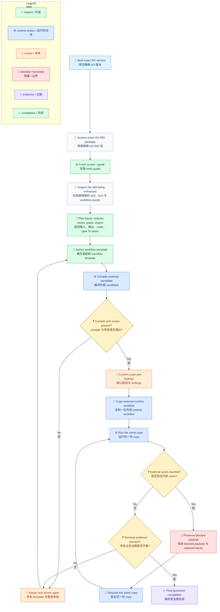

# SkillOrchestrator Flow

[English](../../en/guides/so-guide-flow.md) | [Hub](so-guide.md) | [Reference](so-guide-reference.md) | [根目录](../README.md)

<!-- guide-version:start -->
版本：0.3.326
构建：已发布的 0.3.326 包
<!-- guide-version:end -->


## 用途

这页只保留 SkillOrchestrator 的最短治理执行路径。固定的 `so-guide.md` 是 guide hub；完整契约、治理规则、示例和反模式请阅读 [SO Guide 完整参考](so-guide-reference.md)。

## 流程

下面的路线区分 **enhancing skill** 和 **被增强的 skill**。`compile` 只证明结构；同一份 external workflow copy 必须继续通过 `run` 和所需的每次 `resume`。

图例：`🧭` 接入/导航，`📜` 契约，`🔎` 检查，`📝` 编写，`⚙️` 运行时动作，`💬` 审查，`🚧` 阻塞/边界，`🔁` 继续，`🧾` 证据，`✅` 完成，`❓` 决策。



## Runtime 检查

- 根据操作系统、CPU 架构和 Linux libc 检测唯一 RID，只获取该 RID 对应的精确 SO 发布包。
- 解压前校验 package identity、版本、SHA-512、nuspec、manifest、ZIP 安全、apphost 和英文 guide 文件。
- Windows 先运行 `so.exe --guide`，Unix 先运行 `so --guide`。确认返回版本正确且 guide 路径位于文档根目录内并可读取。
- 后续 schema/demo、compile、run 和 resume 都使用同一个已解压 apphost 和同一份 external workflow copy。
- MCP 仅供后续确实需要它的步骤选择使用；它不是 package、guide、compile、run 或 resume 的前置条件。
- checked-in template 保持不可变；runtime copy、event log 和 audit artifact 放在 skill 目录之外。
- Workflow 自有 schema 和 control metadata 使用英文；用户和业务 payload 可保留来源语言。

## CLI 速查

```powershell
.\so.exe --guide
.\so.exe compile --workflow-file <external-workflow.json> --audit-output <external-audit-root>
.\so.exe run --workflow-file <external-workflow.json> --context-file <context.json> --audit-output <external-audit-root>
.\so.exe resume --workflow-file <external-workflow.json> --result-file <result.json>
```

Unix 使用相同参数调用 `./so`。`--guide` 和 `compile` 用于准备或校验；只有公开的 `run` 与 `resume` 是正式 SO workflow 执行。
## Blocked 返回

读取 `current_step_kind`、`skill_hint`、`required_inputs`、`workflow_file`、`event_log_file` 和已验证的 audit links。需要用户输入时，只询问已经声明的决定或值；runtime-owned facts 通过对应 resume 路径返回结构化数据。保持同一份 external workflow copy。

## 被增强的 Skill 完成

受 Loom Skill Orchestrator 治理的 skill，不会在 guide refresh、template authoring、compile 或 blocked 返回时自动完成。必须有 skill deliverable 变更、review-fix evidence、route 与 gate evidence，并在同一份 copy 上完成公开 run/resume 链路。

## 继续阅读

- [SO Guide Hub](so-guide.md)
- [SO Guide 完整参考](so-guide-reference.md)
- [Workflow Schema](../reference/workflow-schema.md)
- [Workflow 术语](../../en/architecture/workflow-terminology.md)
